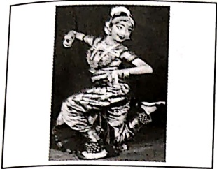

# १- अग्रिमीले पुरोहितं यशस्य देवम् ऋत्वजम् ।

#### होतारं रलधातमम् ॥ ऋग्वेद:, १.१.१

अग्रिम्- संঙ্कूल्य या अभीक्षा स्पेरी जो अग्नि/आत्मा देव हमारे सबके हदय में उपस्थित हैं, इंके - मैं उपासना करता हूँ, पुरोहितम् यशस्य - जो हमारे यज्ञ स्वरूप जीवन में अग्रिणी होकर हमारे संঙ্कूल्य या अभीक्षा को आगे बढ़ाते हैं, देवम्- जो हमारे सारे कर्मों का देव है, ऋत्विजम्- सत्य के संवोतम जाता, होतारम्- देवों का आवाहन करने वाले, रलधातम्म्- आनन्द के संवोतम धारण और वितरण करने वाले।

अर्थ - उपयुक्त मंत्र ऋगवेद के प्रथम (१) मण्डल के प्रथम (१) सूक का पहला (१) मंत्र है। इस

मंत्र के दृष्टा ऋषि मधुच्छन्दा वैश्वामित्र है। देवता अग्नि हैं और छन्द गायत्री है।

वेदों में जहाँ-जहाँ अग्नि की स्तुति की गयी है, वहाँ-वहाँ अग्नि को दो रूपों में देखा गया है-वाह और आर्तिक । कुछ लोग वाह्य अग्नि को आहूति देते समय वैदिक मंत्रों का प्रयोग करते हैं। कुछ लोग आत्मा रूपी अग्नि को आहूति देते हैं।

इस मंत्र के माध्यम से खर्ष मधुचन्द्रा वैश्वामित्र ने अपने भीतर छिपी हुयी आत्मा को सम्बोधित किया है। वे इस आत्मा को अग्नि की उपாधि देते हैं- वह अग्नि जो ऊपर की ओर प्रज्जलित है। हे अग्नि! आप प्रज्जलित हों। इस जीवनरूपी यह के आप ही पुरोहित हैं। आप ही हमारे जीवन का संचालन करें। आप ही पूर्ण परमेश्वर के स्वरूप हैं। आप ही उचित समय के पूर्णसात हैं । आहूति के द्वारा दिव्यस्वरूप परमात्मा का आह्वान करने वाले आप ही हैं। हे अग्नि! परम आनन्द का आप ही अनुभव कर सकते हैं। यहाँ ख्रिष का यह अभिप्राय है कि अपने विचार, अपने भाव व अपने कर्म, समिधा की भाँति, अपने भीतर स्थित अग्निकपी आत्मा में आहूति चढ़ाने से और उन्हें मार्ग प्रदर्शन के लिए आहान से, मनुष अपने

आत्मारूपी ईश्वर से संबंध स्थापित कर, उन्हें अपना मार्ग प्रदर्शक/ पुरोहित बना सकता है।

## २ - अग्रे तंत्र सु जाग्रही वयं सुमनिद्धीमहि । रक्षा गो अप्रयुच्छन् प्रबुधे नः पुनस्कृधि ।। यजुवेंद, ४.१४

सुजागृहि - सम्यक् रूप से जागो, सुमन्दषीमिह - हम पूर्ण रूप से आनन्दत होंव, रक्षाणो - हम सब की रक्षा करो, अप्रयुच्छन् - सतत जागरूक होते हुए, प्रबुधे - हमारे प्रबोधन के लिए अर्थात् हमं अज्ञानरूपी निद्रा से मुक्त करने के लिए, पुनस्कृधि - बार-बार प्रेरित करें ।

अर्थ - यह मंत्र यजुर्वेद के चौथे (४) अध्याय का चौदहवाँ (१४) मंत्र है। इस मंत्र के दर्शा खींप्रजापति है तथा देवता अग्नि हैं।

हे अग्नि ! आप सम्यक्स्फप से हमारे भीतर प्रज्वलित हों जिससे कि हम सजग रहं और हमें बार-बार आपसे प्रेरणा मिले। आप हमें दुष्कर्म करने से रोकें एवं हमारी रक्षा करें। हमें हमेशा जागफुक रखने के लिए और हमें अज्ञानता से मुक्त करने के लिए आप हमें बार-बार प्रेरित करें। आपके अनुभव में ही हमारा परम आनन्द है।

##### उपनिषद्वचनम्

३ - सत्यं वद। धर्मं चर। स्वाध्यायान् मा प्रमद: ।

मातृदेवो भव। पितृदेवो भव। आचार्यदेवो भव।

श्रह्या देयम्। अश्रह्या अदेयम्। श्रिया देयम्। हिया देयम्।

भिया देयम्। संविदा देयम्।। तैतिरीय-उपनिषद्

मा प्रमदः - विमुख मत हो, श्रिया - समस्त प्रकार के विकारों से रहित प्रसवता के साथ, हिंया - विनप्रता के साथ, श्रिया - निःसड्जोच या समर्पित होकर, संविदा - शान के साथ या सचेतन होकर।

अर्थ - यह मंत्र तैतरीय उपनिषद् के प्रथम (१) वर्लूरी का ग्यारहवाँ (११) अनुवाक है, जिसमें समदर्शी गुरु अपने शिष्य को वेद का भली-भाँति अध्ययन करवा करके समावर्तन संस्कार के

समय ग्रहस्थ धर्म का पालन करने की शिक्षा देते हैं।

सत्य वद.....आचारियेदवो भव।

अर्थ - सर्वदा सत्य बोलो। सही मार्ग,धर्म के मार्ग पर चले। स्वाध्याय (स्वयं अकेले बैठकर अध्ययन) में आलख्य मत करो । माता एवं पिता को ईश्वर के समान समझ कर उनका सम्मान एवं सेवा करो । विधा या जान देने वाले गुरु को भी ईश्वर के समान समझो एवं उनको आदर एवं सेवा प्रदान करो ।

प्रश्नका दैनम्न.....संविदा दैनम्य।

अर्थ - जो कुछ भी दिया जाए, वह श्रद्धापूर्वक देना चाहिए। अश्रद्रापूर्वक कोई दान नहीं देना चाहिए। सब प्रकार के विकारों से रहित होकर, प्रसन्नता के साथ देना चाहिए। दान लज़ापूर्वक एवं विनम्रता के साथ देना चाहिए। नि:संकोच भाव एवं समर्पित होकर दान देना चाहिए। दान सदा जाग़रूक्त होकर जाने के साथ देना चाहिए।

एक बार रहोम जी अपने घर के बाहर किसी व्यक्ति को कुछ दे रहे थे, तभी उनके मित्र गंग कवि पूछते हैं -

कहां से सीखे खान जू, एहि प्रकार को देन।

ज्यॉ-ज्यॉ ऊँचो कर उठे, त्यों-त्यों नीचे नैन।

रहीम जी उत्तर देते हैं -

देनहार कोउ और है, देत रहत दिन रेन।

लोग भरम मोहि पर करें, तातै नीचे नैन।

गीतामृतम्

8 - यत्र योगेशर: कृष्णो यत्र पार्थो धनुधर: ।

तत्र श्रीविजयो भूित: धुवा नीतिमितमम् ।। श्रीमद्भगवद्गीता, १८.७८

यत्र - जहॉर्स, योगेशर: - भगवान, पार्थ: - अजुन का एक नाम, श्री: - समृद्रि, भूति: - ऐश्यर, धुवा - निशित, नीति: - सिद्धान्ना, मति: - मत ।

##### दिल्खवाणी

अर्थ - यह एलोक महिषी वेदव्यास के द्वारा रचित श्रीमद्भागवद्गीता के अठारहवें (१८) अध्याय का अन्तम अठतरावां (७८) एलोक है।

स्वजय कहते हैं कि जहाँ-जहाँ श्रीकृष्ण और अर्जुन हैं, वहाँ-वहाँ समुद्रि, विजय एवं ऐश्वर्य हैं। ऐसा सज्जन का दृढ़ विश्वास है।

ईश्वर सदैव हमारे भीतर आत्मा के रूप में विधमान हैं। यदि हम आत्मस्पी गुरु को अपने विचार, अपने भाव और अपने कार्य समर्पित करते रहे तो निश्चित ही अजुन की भाँति हम भी समृष्टिकी, विजय एवं ऐश्वर्य को प्राप्त करते रहे हो।

## ५ - यो मां पश्यित सर्वत सर्वं च मिय पश्यित ।

तस्फाहं न प्रणेध्यामि स च मे न प्रणेध्यिते ।। श्रीमद्भगवद्गीता, ६. ३०

पश्यित - देखता है, सर्वत्र - सब जगह, सर्व - सब कुछ, मयि - मुझमें, प्रणस्थामिन - नष्ट होना, प्रणस्थित - नष्ट करता है।

अर्थ - यह श्लोक महर्षि वेदव्यास रचित श्रीमद्भगवद्गीता के छठवें (६)अध्याय का तीसवाँ (३०) श्लोक है।

श्रीकृष्ण अजुन को अपनी सर्व्यापकता के बोरे में बताते हुए कहते हैं कि हे अजुन! जो मुझे चल-अचल तथा सभी जगह देखता है और सबको मुझमें देखता है, वह मेरा अनुभव कर सकता है। मै उसके साथ सदा रहता हूँ और उसका कभी नाश नहीं होने देता हूँ। वह कभी मुझसे दूर नहीं होता है।

##### नित्यपाठ:

करदर्शनाय

करग्रे वसते लक्ष्मी: करमधे सरसवती।

करमूले तु गोविन्द: प्रभाते करदर्शनम्॥

भूमिनमनाय

समुद्रवसने देवि पवितस्तनमण्डले।

विष्णुपति नमस्तुभ्यं पादसर्शं शमस्व मे॥

सनाय

गड़े च यमुने चैव गोदाविर सरसवति।

नमदे सिंभु कावोरी जलेऐसिम्न् सरिप्रिधं कुर॥

चन्दनधारणाय

चन्दन वन्दते नित्यं पवित्र पापनाशनम्।

आपदं हरते नित्यं लक्ष्मी: वसतु सर्वा॥

सूर्धार्य

एिं सूर्य सहस्रांशो ! तेजोराशे ! जगतपते !

अनुकम्य मां भकत्या गृहाणाच्यं दिवाकर॥

भोजनाय

त्वदीयं वस्तु गोविन्द ! तुभ्यमेव समपेये।

गृहाण सममुखो भूत्वा प्रसीद परमेधर॥

पुच्छहीन: भलुक:

जानासि, कुक्करस्य पुच्छम् अस्ित न वा ? आम् अस्ित। शृगालस्य ? आम्

अस्ित। व्याप्रस्य ? आम्, अस्ित। भलुकस्य ? न हि, भलुकस्य पुच्छं नास्ित। भलुकस्य

पुच्छं किमथं नास्ित ? कुकुरस्य अस्ित, शृगालस्य अस्ित। पूर्व भलुकस्य अपि पुच्छम्

आसीत्-अतीव सुन्दर पुच्छम्, विशालं पुच्छम्। जानासि, कथं तस्य पुच्छं गतम्?

कथयामि, शृणु।

पूर्वम्, बहुवर्ष्यः पूर्व भल्यक:, कुकुर:, शृगाल: मित्रिंग आसन्। एकदा बहुशीत

भवित।

तदा दिने अति शीतम्। कुज़ापि भोजनं नास्ित। शौतरात्रिः। शृगालाः कुज़रंशच मत्यं धर्तुं गतौ। सर्वत्र हिमम्। शृगालाः हिमे गतर्च करोति। परं दौं मिलित्वा मत्यान् धरतः, एकं: द्वै, ज्यं: चत्वारः ..... यदा नव मत्याः भवितं तदा भलुकः आगच्छित। भलुकः पृच्छित, “किं कुरुथः? अहो मत्यः ! अहम् इच्छामि, अहं खादिष्यामि, अहं भृशं शुधितः। शृगालाः कथ्यति, भ्रातः भलुकं ! विभजाम। मम ज्यः मत्याः, कुकुरर्य ज्यः मत्याः तव ज्यः मत्याः।” भलुकः न शृणोति। सः सर्वान् मत्यान् खादिते। कुकुरः दुःखितः। शृगालाः शुधितः। भलुकः आनिन्दतः गतः। शृगालाः कथ्यति “भलुकः कथ्यएवं सर्वान् मत्यान् खादिते ! अहं दर्शिय्यामि तम्।

शृगाल: अतिच्तुर:। स: भलुकस्य पाश्वं गच्छित, सुन्दरभावेन वदित, “भ्रात: भलुक! त्वं मतस्यान् इच्छिस ? बहून् मतस्यान् दास्यामि। आगच्छ मया सह। लोभी भलुक: शृगालेन सह गच्छित। शृगाल: तं बहुदूरं नयित। परं हिमे एकं गतं खनित। “भात: ! अत्र नीचे: बहव: मतस्या: सिनत। त्वं गतं पुच्छं पूर्य । शान्तभावेन उपविश। किंच्वतकालात् परं मतस्या: आगमिषचित्त, पुच्छं धिरधिन्त। एकं: मतस्या: दौए मतस्या, ज्य: मतस्या:, परं बहव: मतस्या: आगमिषचित्त। श्व: प्रभाते, यदा पुच्छं भारी भवित, तदा एकम्, दे, ग्रीण गणयित्वा पुच्छं बलेन कर्ष। सर्वं मतस्या: गतित् बहिर् आगमिषचित्त। करिष्यिंसि ?

भलुकः आम् कथियत्वा गतं पुच्छं पूर्ियत्वा तत्र शान्तभावेन उपविशति। शूगालः तस्य पुच्छस्य चतुदिशं हिमं स्थापयित। पुनर्देश्नाय इति कथियत्वा गच्छित। लोभी भलुकः तत्वं उपविशति। रात्रिः आगता। शीतं प्रबல்ं भवति। हिमं पतति। हिमं पुच्छस्य उपरि मन्दं मन्दं ह॒तं भवति। गतं मन्दं मन्दं पूर्णं भवति। भलुकस्य पुच्छं मन्दं मन्दं भारी भवति। सः चित्यति श्वः प्रभाते बहून् मतस्यान् प्राप्थ्यामि। प्रभातं भवति। दूरात् शूगालः आहृयति, “भलुकभ्रातः! पुच्छं भारि भवति?” भलुकः कथियति-“ आम्,” बहु भारि। अहं पुच्छं चालियतुम् अपि न शकनोमि।” शृगालः हसन् कथियति, “भलुकभ्रातः! एकम्, दे, ग्रीणं कथियत्वा कर्ष, बलेन कर्ष। अधुना सर्वे मतस्याः तव।" भलुकः दीर्घं श्वसित्, गणयित्- एकम्, दे, ग्रीणं। परं पूर्णबलेन कर्षितं। तस्य मुखं रक्षितं। सः पुनः कर्षितं, अधिकबलेन कर्षितं। हठात् ठक्न्। भलुकः भूमौ पित्तः। सः पृष्ठे पश्यति।

कानपुर की विजयतत? मम पुच्छों कुछ? कुछ मतस्या: ? भलुकस्य पुच्छे खुटात् । स: स्वपुच्छे हिमे पश्यति। भलुक: पुन: पुन: पुच्छम् अन्वेषयति। गतं पुच्छे हृदा स: कथयति, "अरे मम पुच्छे खुटात्। तदा दूरात् शृगाल: हसन् कथयति, "अरे भलुकक्षात:! मतस्या: धृता: ? कित मतस्या: प्राप्त: ? भलुक: क्रोधेन गजित्त। स: शृगालं मारियतुम् धावति। शृगाल: पलायते। तस्मात् दिनात् भलुकस्य पुच्छे नास्ते। केवलम् एकं लघुखण्डं तिष्ठति। तदेव तस्य पुच्छम्। अधुना जानासि, भलुकस्य पुच्छे किमथ् नास्ते?

##### पரிशिस्తानि

##### कः कि करोति ?

##### पரிशिस्लानि

##### ्यावहारिक: शब्दकोश:

[Table 1](tables/table_001.html)

भह्य-लेह्य-पेय-चोष्यवगिण

दाल (कच्ची)- हिन्दलम्

दाल (रंक्षी) - दालि:

मिश्र - सितोपला

मिठाई - मिखान्म्

लड्डू - लड्डुक:

जलेबी - कुण्डिलिनी

वस्ताणि शायोपरकराणि च

धोती - धौतवसम्

साड़ी - शाटी

लंगोटा - कौपीनम्

कमीज - कखुकम्

हाफ कमीज - अर्धकखुकम्

अंगरखा - अझरक्षकम्

चادر - उतरियम्

अगौछी - अझप्रोछनी

रमाल - करवसम्

पगड़ी - उर्णीष:

टोपी - टोपिका

बिछेना - आस्तरणम्

रजई - नीशार:

कम्बल - कम्बल:

गद्दी - संस्तर:

मच्छरदानी - मशहरी

तिकिया - उपधानम्

वाहनानि

सवारी - यानम्

रेलगाड़ी - संयानम्, गनी

बैलगाड़ी - शकटम्

हवाई जहाज - वायुयानम्

जहाज - पोत:

एम्बुलेस - रोगीवाहनम्

फायर ब्रिगेड- अग्निशमनयानम्

टेलि - हस्तवहम्

रिकशा - त्रिचिकका / वहम्

बस - लोकयानम्

आटो रिकशा - इर्यवहम्

ट्रक - भार्यानम्

सूल बस - शाल्यानम्

јелікапстর - उदग्रविमानम्

- पात्रम्

बरतन

बटलोही - स्थाली

कराही - कनु:

तावो - ऋजीषम्

कंछुल - द्वि:

सड़सी/चिमटा - संदेशक:

##### गृहोपकरणानि

अरगनी - लड़नी

ताला - तालकम्

चாबी - कुच्चका

खार - खटवा

पलज्ज - पयर्ज्ः

कुलहड़ी - कुठारः

कैची - कतिरी

पीछा - पीठ:

छूरी - घुरीका

चौकी - पीठिका

दिया  -  दोप:

बती - वर्तिका

ऐना - दर्षणः

आगन - अड़नम्

माचिस - अग्निपेटिका

कटोरा - कटोर:

कुआ - कूप:

चमलच - चमस:

दौत ब्राश - दनाकूचि:

बाल्टी - दोल:

छत - छादम्

विश्वकी - वातायनम्

बाथ्सम - स्नानागर:

कंची - कंकतिका

डोरा - सूत्रम्, तत्त्व:

छाता - छनम्

छड़ी - यष्टि:

खड़ाऊँ - काष्ठपादुका

सीढ़ी - सोपानम्

बिजली का पंखा - विधुद्यजनम्

पंखा - व्यजन्म

ఏఱ్ఱ - చెట్ల

तराजू - तुला

संदूक - मंजूषा

पेटी - पेटिका

माचिस तोली - अगनीषिका

आयरन - आस्त्री/समीकरम्

चटार्ई - कटर्ः

टोकरो -  करण्ड:

बोतल - कूणी

कप - चषक:

मॅजन - दनतमॅजनम्

दरवाजा - द्वारम्

बरामदा - वरण्ड:

बेड्सम - शयनकक्ष:

कूलर - शीतकम्

##### अद्वारतं संस्कृतम्

एयरे बच्चों इस पाठ में हम आपको संरक्षित साहित्य के उस जगत से परिचित करावियों जो अद्वार होने के साथ साथ चमत्कारिक भी हैं । जिसे पढ़कर आपके मुख से अनायास ही निकल पड़ेगा अद्वारतंसकृतम्। तो आइये जानते हैं इस अनुपम काल्योंली के विषय में । क्या आपने कभी ये सुना है कि एक ही अक्षर के प्रयोग से एक पूरा पधबन सकता है ? क्या आप ये जानते हैं कि एक पध को दाएं से बाएं पड़े हो एक अर्थ तथा बाएं से दाएं पढ़ो तो दूसरा अर्थ निकलता है ? क्या है न शचकर ? इस कालयोंली के विषय में सुनकर स्वतः ही इसको पढ़ने का कुतूहल उत्पद हो जाता है और साथ ही साथ उन उच्च कोटि के विद्वान कवियों के प्रति भी मस्तक शब्द से झुक जाता है, जिन्होंने ऐसे अद्वारतंसकृतता का सुजन किया।

इन महाकावियों ने अपनी लेखनी द्वारा प्रखर विद्वाता का परिचय देते हुए সংस्कृत जगत को एक न्यास्प दिया है। धन्य है ऐसे यशस्वी कवि और उनका काल्यकौशल । नमन योग्य है वह সংस्कृत भाषा जो असंभवको संभव करने में समर्थशालिनी है । वन्दनीय है वह সংस्कृत जिसने इस देवभाषा को न केवल जन्म दिया वर्नपाल पोषकर इतने सालों से जीवित रखा है । आगे भी ये देवभाषा सदियों तक चिरायु रहते हुए अपनी विद्वाता से विश्व की उद्यत का मार्ग प्रशस्त करे, ऐसी कामना हम करते है ।

३२ अक्षरों का यह अविशेषसनीय श्लोक है । जिसमे एक ही स्वर और एक ही व्यक्त का प्रयोग मिलता है । पूरे पय में ‘य’ और एक स्वर ‘आ’ का प्रयोग किया गया है ।

यायायायायायायायायायायायायाया। यायायायायायायायायायायाया।

अर्थ - भगवान को शोभित करने वाली पादुकार्ण । जो सभी प्रकार के मंगल और शुभ की प्रास में सहायक है । जो

हान देती है । जो भगवान को अपना बना लेने की इच्छा को जगाती है । जो सारे श्रुततापूर्ण भाव को हटती है ।

जिन्होंने प्रशु को प्रातिकिया है । जिनका एक स्थान से दूसरे स्थान तक आने-जाने में उपयोग होता है । जिनके

द्वारा संसार के सभी स्थानों तक पहुँचा जा सकता है । ये पादुकार्ण भगवान विषणु के लिए हैं ।