Subject: Maths</td><td style='text-align: center; word-wrap: break-word;'>Topic: Ordinal Numbers</td></tr></table>

Date ___

1. Follow the directions below and colour the circle band.

• Colour the second  $ (2^{nd}) $ circle RED.

• Colour the third  $ (3^{rd}) $ circle BLUE.

• Colour the first  $ 1^{st} $ circle ORANGE.

• Colour the fifth  $ 5^{\text{th}} $ circle GREEN.

• Colour the eight  $ 8^{th} $ circle PURPLE.

Don't colour the tenth  $ (10^{th}) $ circle.

 $$ (7^{\mathrm{t h}}) $$ 

• Colour the ninth  $ 9^{th} $ circle BROWN.

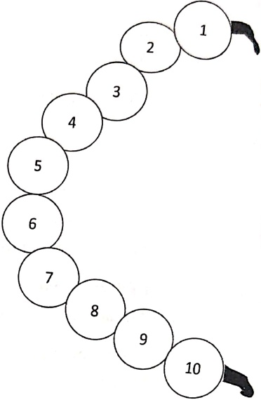

2. Read the problem. Place the ordinal number under each of the animal's name to show the place they came in.

The local animals had a race.

Ben Bear came first. Ernie Elephant came second. Charlie Chick came third. Abe Ape came fourth.

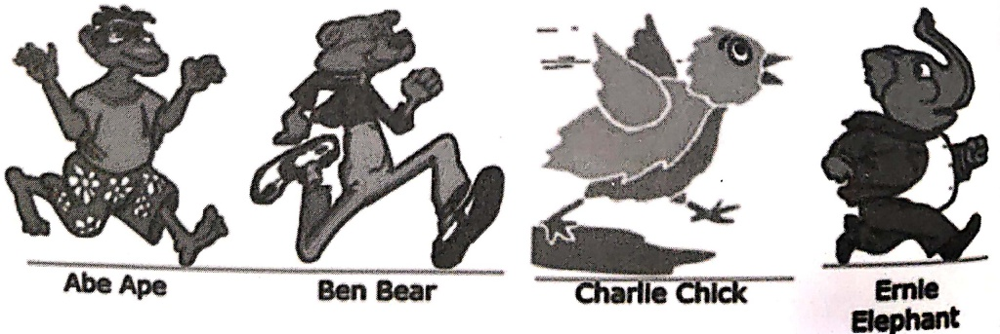

Abe Ape

Ben Bear

Charlie Chick

Ernie Elephant

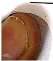

[Table 1](tables/table_001.html)

Date: _____

Q1. Direction: Fill in the blanks with the given day of the week. Start with Monday as the  $ 1^{st} $ day of the week and complete the statements.

A. _____ is the first (1 $ ^{st} $) day of the week.

B. _____ is the second (2 $ ^{nd} $) day of the week.

C. _____ is the third (3 $ ^{rd} $) day of the week.

D. _____ is the fourth (4th) day of the week.

E. _____ is the fifth (5th) day of the week.

F. _____ is the sixth (6th) day of the week.

G. _____ is the seventh (7th) day of the week.

[Table 2](tables/table_002.html)

Q2. Look at the line of children playing FOLLOW THE LEADER. Ryan is the leader.

a) Who is in the tenth place?_____

b) Which place is Mindy in?_____

c) If Tony and Tom leave the line, what place would Mindy be in? _____

d) If Lou moves ahead in front Suzy what place is she now? _____

[Table 3](tables/table_003.html)

[Table 4](tables/table_004.html)

##### Direction: Solve the given questions

1. Write the ordinal numbers that tell what place each item is in.

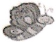

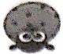

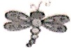

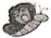

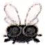

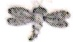

a. The

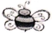

is in the  $ \underline{\text{____}} $ place.

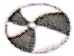

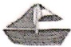

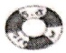

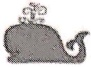

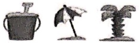

b.

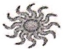

The

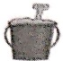

is in the  $ \underline{\text{place}} $.

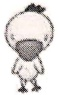

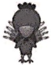

c. The

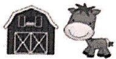

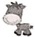

is in the  $ \underline{\text{place}} $.

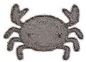

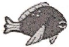

d. The

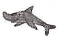

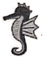

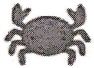

is in the _____ place.

2. Circle the image of the object which tells the given position of the object

1.

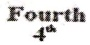

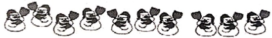

2.

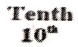

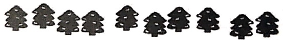

3. Second $2^{m}$

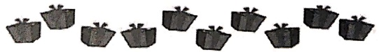

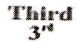

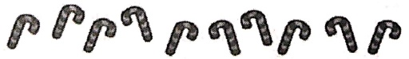

4

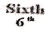

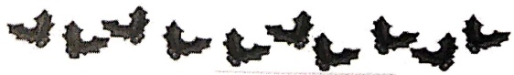

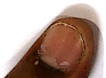

<table border=1 style='margin: auto; word-wrap: break-word;'><tr><td style='text-align: center; word-wrap: break-word;'>Grade: 1</td><td style='text-align: center; word-wrap: break-word;'>