Subject: Maths</td><td style='text-align: center; word-wrap: break-word;'>Topic: Subtraction</td></tr></table>

Date:___

Direction: Cross out to subtract and find the answer.

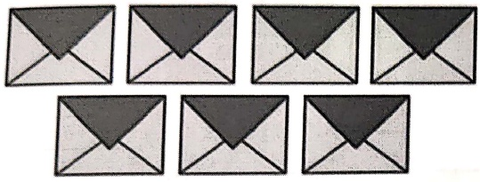

 $$ 7-3=\Box $$ 

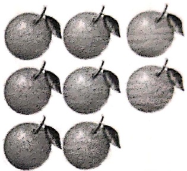

 $$ 8-4=\Box $$ 

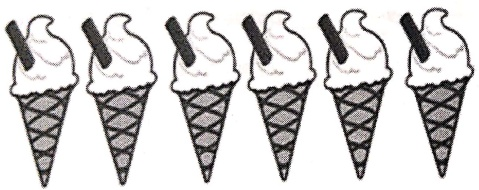

 $$ 6-2=\Box $$ 

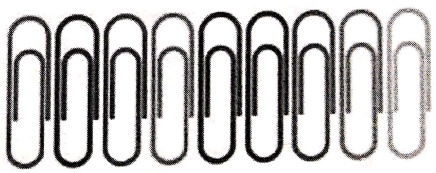

 $$ 9-4=\Box $$ 

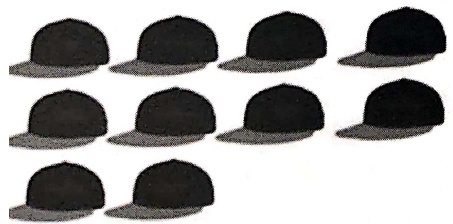

 $$ 10-3= $$ 

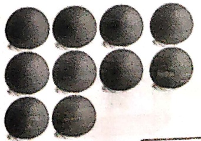

 $$ 10-8= $$ 

[Table 1](tables/table_001.html)

Date: _____

##### Solve:

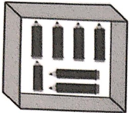

7 pencils

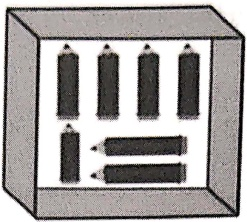

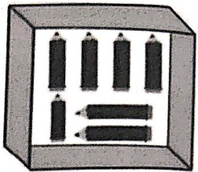

no pencils taken out

7 pencils

7-0=7

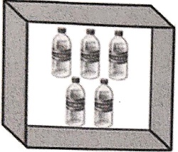

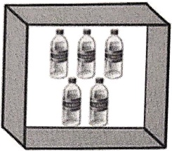

5 bottles

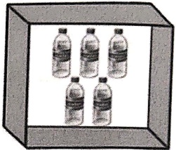

no bottles taken out

bottles

5-0=

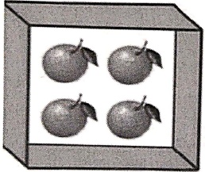

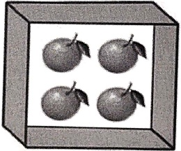

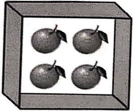

4 oranges

no oranges taken out-

___ oranges

4-0=

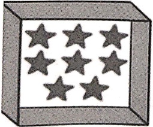

8 stars

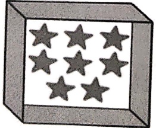

no stars taken out

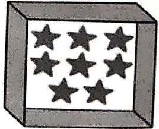

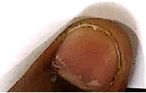

___ stars

8-0=

[Table 2](tables/table_002.html)

Date: ___

Subtract the number in the middle wheel from the number in the innermost wheel and write the answer in the outermost wheel.

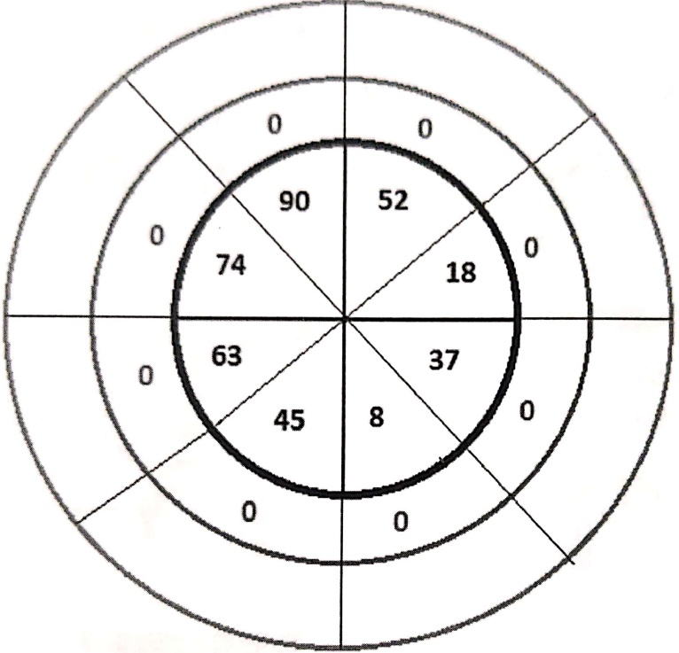

Tick the statements that are correct. Write the correct answers for ones that are incorrect.

[Table 3](tables/table_003.html)

[Table 4](tables/table_004.html)

Date: ___

Direction: Cross out the bangles wanted by these kids and write the answer.

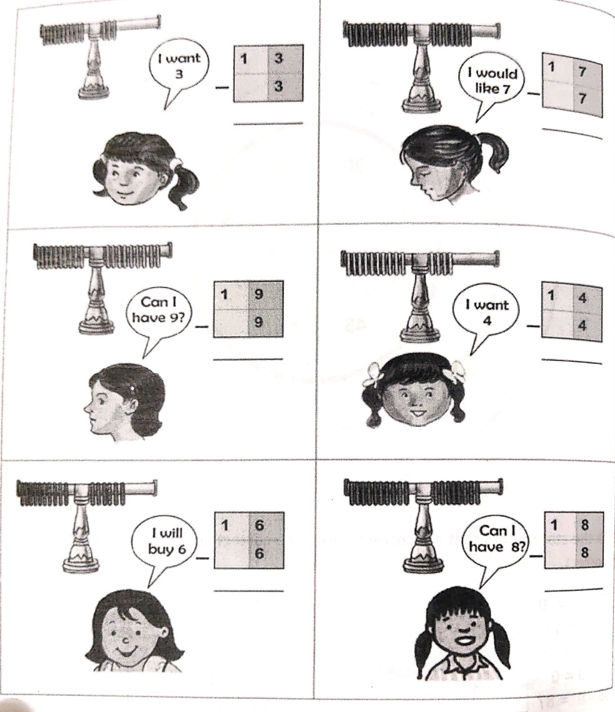

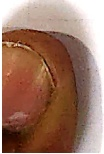

[Table 5](tables/table_005.html)

Date: ___

Directions: Highlight a group of ten. Find the answer using the crossout method.

a.
 

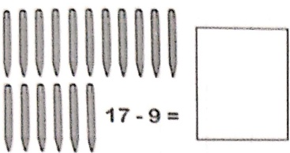

b.
 

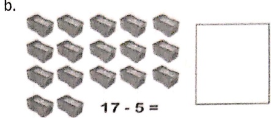

C.
 

d.
 

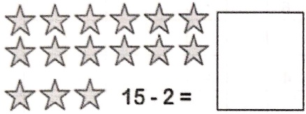

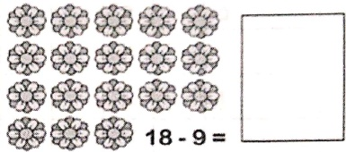

2. Find the answer by drawing sticks and crossing them out.

a. 17 - 3 =

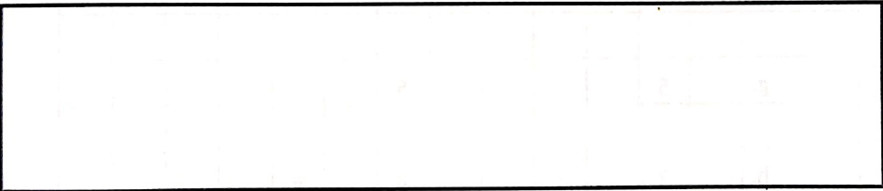

b. 20 - 7 =
 

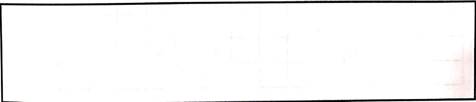

[Table 6](tables/table_006.html)

Date: ___

Solve the following:

[Table 7](tables/table_007.html)

[Table 8](tables/table_008.html)

Date:___

Solve the following:

[Table 9](tables/table_009.html)

[Table 10](tables/table_010.html)

Date: ___

Solve the following:

[Table 11](tables/table_011.html)

[Table 12](tables/table_012.html)

Date:___

Solve the following :

[Table 13](tables/table_013.html)

[Table 14](tables/table_014.html)

Date:_____

Solve the following :

[Table 15](tables/table_015.html)

[Table 16](tables/table_016.html)

Date: ___

 $ \underline{\text{Directions:}} $ Observe picture A and picture B and fill in the table below and subtract. First one has been done for you.

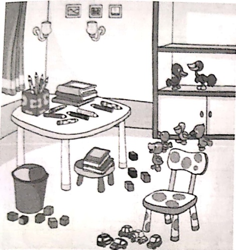

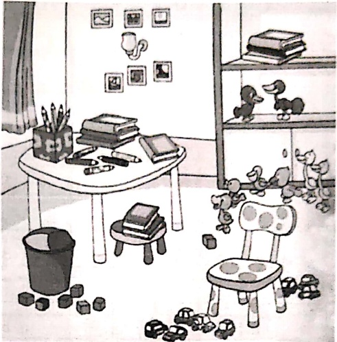

[Table 17](tables/table_017.html)

[Table 18](tables/table_018.html)

Date: ___

Solve the following :

[Table 19](tables/table_019.html)

[Table 20](tables/table_020.html)

Date:___

Solve the following :

[Table 21](tables/table_021.html)

[Table 22](tables/table_022.html)

Date:_____

Solve the following :

[Table 23](tables/table_023.html)

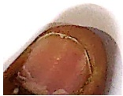

[Table 24](tables/table_024.html)

Date:___

Solve the following :

[Table 25](tables/table_025.html)

[Table 26](tables/table_026.html)

Date: ___

Q1.

Colour Me

Find the difference. Use the key below to colour in each space to dress up the turtle.

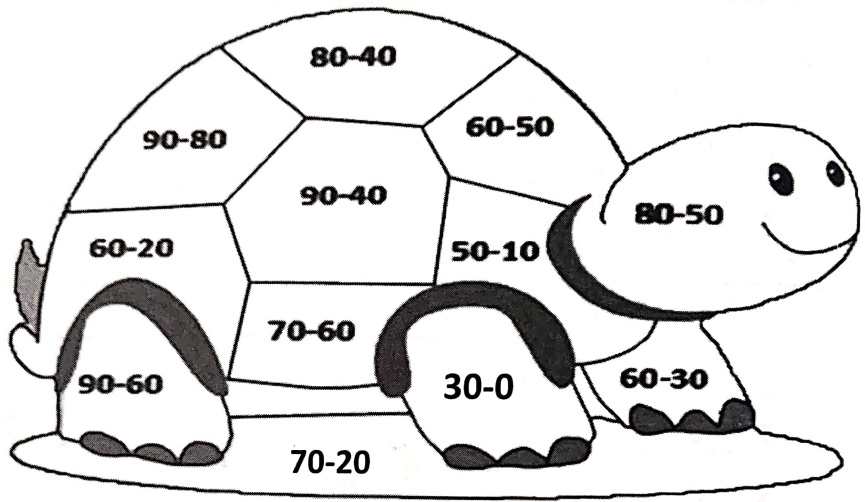

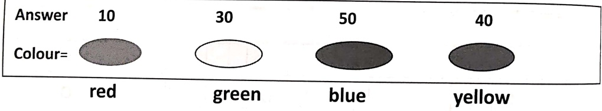

#### Q2. Real Life Application

Mother gave me 50 rupees. I bought food for my dog worth 40 rupees. How much money am I left with?

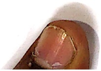

[Table 27](tables/table_027.html)

Date:_____

(A) Solve each of the following and match the questions with their answers.

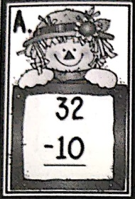

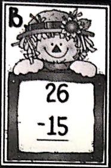

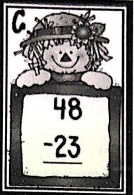

a. 11

b. 25

c. 22

Write the alphabet of the answer next to the question.

A. ___

B. ___

C. ___

(B) Solve

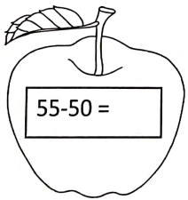

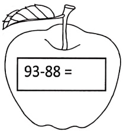

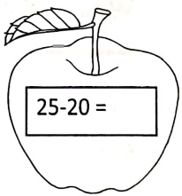

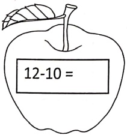

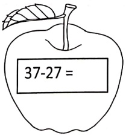

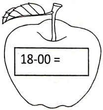

[Table 28](tables/table_028.html)

[Table 29](tables/table_029.html)

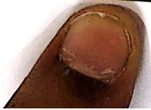

[Table 30](tables/table_030.html)

Date:___

Solve the following :

[Table 31](tables/table_031.html)

[Table 32](tables/table_032.html)

Date:___

Word Problem :

[Table 33](tables/table_033.html)

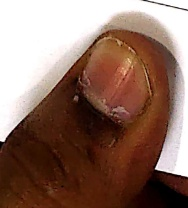

[Table 34](tables/table_034.html)

Date:___

##### Number bonds

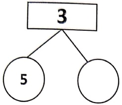

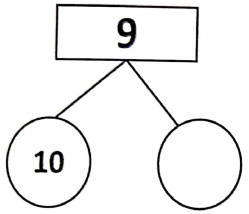

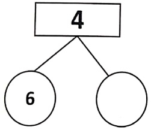

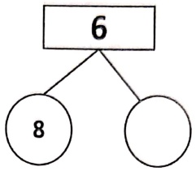

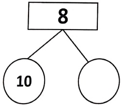

[Table 35](tables/table_035.html)

Date:___

Use subtraction to complete each number bond-

<table border=1 style='margin: auto; word-wrap: break-word;'><tr><td style='text-align: center; word-wrap: break-word;'>Grade: 1</td><td style='text-align: center; word-wrap: break-word;'>