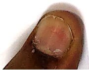
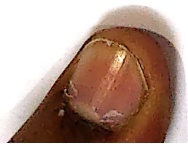

Subject: Maths</td><td style='text-align: center; word-wrap: break-word;'>Topic: Addition/Subtraction</td></tr></table>

Date: ___

Solve the following:

[Table 1](tables/table_001.html)

[Table 2](tables/table_002.html)

Date:___

Solve the following :

[Table 3](tables/table_003.html)

[Table 4](tables/table_004.html)

Date: ___

Solve the following:

[Table 5](tables/table_005.html)

[Table 6](tables/table_006.html)

Date:___

Solve the following:

[Table 7](tables/table_007.html)

[Table 8](tables/table_008.html)

Date:___

Solve the following:

[Table 9](tables/table_009.html)

<table border=1 style='margin: auto; word-wrap: break-word;'><tr><td style='text-align: center; word-wrap: break-word;'>Grade: 1</td><td style='text-align: center; word-wrap: break-word;'>