Subject: Maths</td><td style='text-align: center; word-wrap: break-word;'>Topic: Mental Maths</td></tr></table>

Worksheet: 8

Date ___

Use addition or subtraction to complete each number bond-

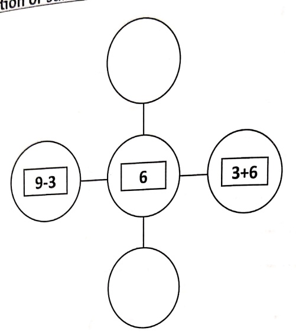

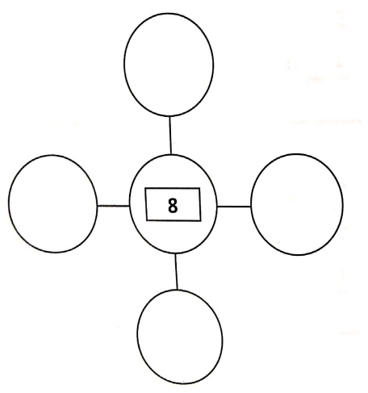

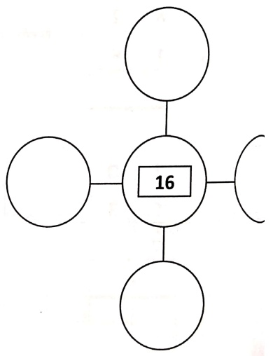

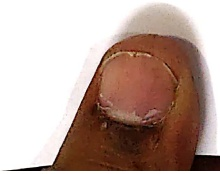

[Table 1](tables/table_001.html)

Worksheet : 9

Date _____

Solve the following:

[Table 2](tables/table_002.html)

[Table 3](tables/table_003.html)

[Table 4](tables/table_004.html)

Worksheet :11

Date___

Solve the following:

[Table 5](tables/table_005.html)

[Table 6](tables/table_006.html)

[Table 7](tables/table_007.html)

Practice sheet 1

Date ___

Q1. If you start counting from 5, how many numbers would come before s_____

Q2. After counting till 3, Sarah found 4 more shiny marbles. How many marbles did she find in all? _____

Q3. Jony had 5 candies before sharing with his friends. After sharing, he had 2 left. How many candies had he given to his friends? _____

Q4. Amy had an empty box. He plucked 6 apples from the apple tree and put them in the box. How many apples are there in the box? _____.

Q5. There are 7 tens on my right hand and 2 ones on my left hand. Which number do I have with me? _____

[Table 8](tables/table_008.html)

#### Practice sheet 2

Date _____

Q1. Lily has 6 cookies and Mia has 10 cookies. Mia has more cookies than Lily.

Q2. I have 80 rose buds. I can make _____ group of tens.

Q3. The place value of 9 in number 19 is _____.

Q4. There are 3 animals hiding in the dark room. They have _____ pair of eyes.

Q5. In the Math class, Maya won 10 stickers and Binny won 4 stickers. Who won more number of stickers? _____

[Table 9](tables/table_009.html)

Practice sheet 3

Date

Q1. Solve-

[Table 10](tables/table_010.html)

Q2. The number has 2 in tens place and the number in ones place is 4 more than 4. The number is _____

Q3. Write the biggest and the smallest two digit number.

Biggest Number _____

Smallest Number _____

Q4. Find the missing number-

a) 80=80+___

b) 54=___+4

c) ___ = 20 + 2

Q5. Complete the table-

[Table 11](tables/table_011.html)

[Table 12](tables/table_012.html)

Date _____

Q1- What comes next in sequence-

a) 5,10,____,____,____

b) 30,40,____,____,____

c) AB CD EF ___ ___ ___

Q2- Complete the pattern-

♢□O

 $ \underline{\text{Q3- Solve-}} $

[Table 13](tables/table_013.html)

Q4- Fill in the blanks-

a) How many times the letter 'C' comes in 'CAPSICUM'

b) What is the place of the letter 'T' in the word 'VEGETABLES'

Q5- Spot the odd one out-

a) FIRST, SECOND, THIRD, FORTH, FIFTH

b) Monday, Tuesday, Wednesday, March, Thursday

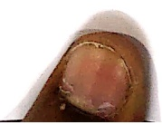

[Table 14](tables/table_014.html)

### Practice Sheet 5

Date-___

Q1- Use addition or subtraction to complete each number bond

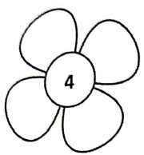

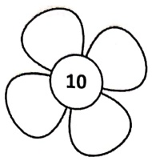

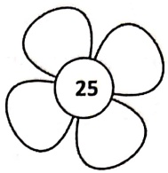

Q2-_____ is greater than 45 but smaller than 73.

a) 88 b) 40 c) 25 d) 62

Q3- Find out a meaningful word by unscrambling the letters.

S U R I C C

_____

Q4- Find the numbers that give a difference.

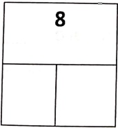

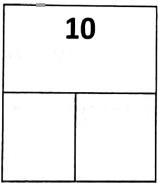

[Table 15](tables/table_015.html)

### Practice Sheet 6

Date-___

a)  $ 20+2= $ _____ tens + _____ ones.

b) Put the correct sign ($<,>,=$)

a)  $ 40+5 $_____75

b)  $ 10+5 $ ___  $ 7+4 $

c) $15+5$_____ $5 \times 4$

d)  $ 6+6 $_____6×6

c) 1 more than the smallest 2 digit number-_____

d) 4 tens + 5 ones - 3 tens + 5 ones = ___

e) 20=___X 10

f) There are 9 plates on a table. 3 plates fell down and broke. How many plates are there?

g) In the word APPLE:

i. The third letter is____.

ii. E is the ___ letter.

iii. Starting from right side which is the second letter_____

iv. Which letter is twin of the letter on the second place _____

h) _____ comes between January and March.

i)  $ 8 \times 9 = \_\_\_ $

j) One less than 31 is ___.

[Table 16](tables/table_016.html)

Worksheet 1

Date: ___

### Choose the correct options:

Find all the missing numbers between 5 and 9.

a) 6, 7, 8, 9

b) 6, 7, 8,

c) 5, 6, 7, 8

d) 5, 6, 7, 8, 9

2. Find all the missing numbers between 9 and 14.

a) 11, 12

b) 10, 11, 12, 13, 14

c) 10, 11, 12, 13

d) 13, 12, 11, 10, 9

3. Find all the missing numbers between 70 and 75.

a) 71, 72, 73 b) 70, 71, 72, 74

c) 71, 72, 73, 74 d) 71, 72, 73, 76

4. Find all the missing numbers between 95 and 100.

a) 97, 98, 99

b) 96, 97, 98, 99

c) 99

d) 96, 99

5. 5 more than 25 is ___.

a) 26 b) 30

c) 29 d) 28

6. 8 more than 47 is ___.

a) 48

c) 55

7. 2 less than 41 is ___.

a) 34 b) 39

c) 37 d) 48

8. 8 less than 79 is _____.

a) 78 b) 89

c) 72 d) 71

[Table 17](tables/table_017.html)

Date: _____

9. The greatest number is ___.    
a) 62 b) 58    
c) 47 d) 84    
10. ___ is greater than both 62 and 79.    
a) 84 b) 79    
c) 47 d) 58    
11. ___ is greater than 79.    
a) 84 b) 62    
c) 58 d) 47    
12. ___ is smaller than 58.    
a) 84 b) 62    
c) 79 d) 47    
13. ___ is greater than 23 but smaller than 40.    
a) 30 b) 15    
c) 62 d) 55    
14. ___ is the smallest number.    
a) 14 b) 81    
c) 8 d) 41    
15. ___ is smaller than 49 but greater than 16.    
a) 54 b) 89    
c) 49 d) 19

[Table 18](tables/table_018.html)

#### Worksheet 2

Date: ___

Choose the correct options:

1.  $ \underline{\qquad} $ is greater than 90 but smaller than 100.

a) 89

b) 92

c) 77

d) 63

2. Which option shows the complete pattern in each case?

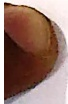

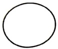

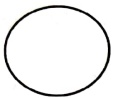

a) 5, 10, 15, 18, 25, 30

c) 5, 9, 15, 20, 25, 30

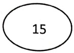

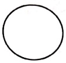

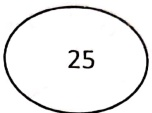

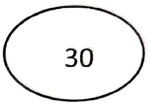

5, 10, 15, 20, 24, 30

5, 10, 15, 20, 25, 30

3. Which option shows the complete pattern in each case?

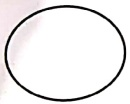

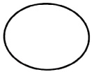

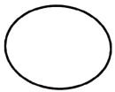

a) 2, 10, 18, 26, 34, 40

c) 2, 4, 6, 8, 10, 12

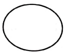

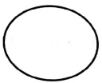

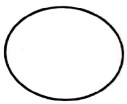

2, 10, 18, 36, 34, 42

2, 8, 18, 26, 34, 42

4. How many birds are there?

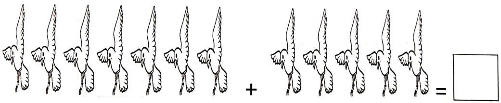

a) 11

c) 2

b) 12

d) 35

[Table 19](tables/table_019.html)

Date: _____

5. How many dolphins are there?

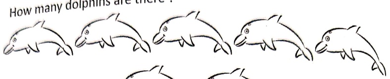

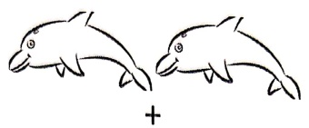

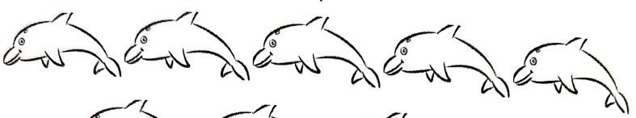

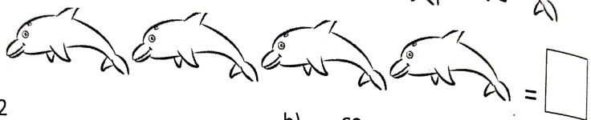

a) 2

b) 63

c) 16

d) 15

6. Find the numbers that give a sum of

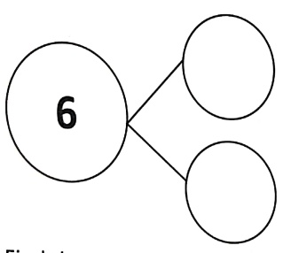

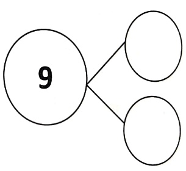

7. Find the numbers that give a difference

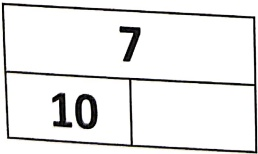

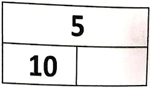

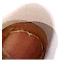

[Table 20](tables/table_020.html)

Worksheet 3

Date: ___

Choose the correct options:

1. There are

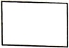

more stars than sun.

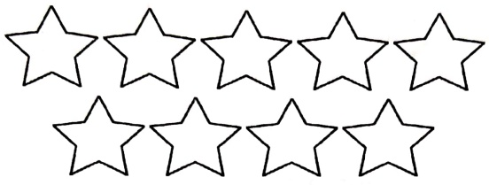

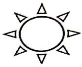

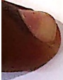

a)

9

b)

c)

8

4

d)

6

2. There are

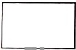

more rats than cats

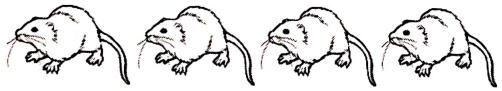

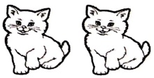

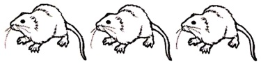

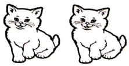

a) 11

c)

b) 3

7

d) 4

[Table 21](tables/table_021.html)

Date: ___

3. There are  $ \boxed{\text{more ducks than sheep}} $.

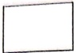

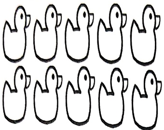

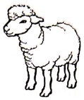

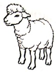

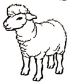

a) 3

c) 8

b) 13

d) 7

4. There are  $ \boxed{\text{more balloons than caps.}} $

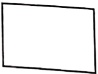

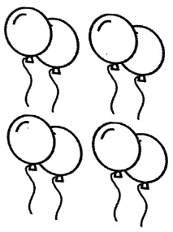

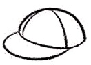

a) 4

c) 3

b) 5

d) 6

[Table 22](tables/table_022.html)

Date: ___

Q1.  $ \underline{\text{Write the next three terms of each pattern}} $:

a) A, B, B, A, B, B, A, B, ___, ___, ___

b) 5, 9, 5, 9, 5, 9, ___, ___, ___

c) P, Q, R, P, Q, R, P, ___, ___, ___

d) 8, 4, 4, 8, 4, 4, ___, ___, ___

e) 1, 2, 3, 1, 2, 3, ___, ___, ___

f) 10, 20, 30, 40, ___, ___, ___

g)  $ \triangle $,  $ \nabla $,  $ \bigcirc $,  $ \triangle $,  $ \nabla $,  $ \bigcirc $, ___, ___, ___

h) A, B, C, A, B, C, ___, ___, ___

Q2. Ria loves to play with toys. New toys give her happiness. On her 5th birthday her father gifted her 5 new toys. Next birthday she went to meet her uncle who gave her 5 toys more. Ria's happiness knew no bound. Her mother on her 7th birthday gave her 5 more wonderful gifts. How many gifts does she have by the end of her 7th birthday. Represent it through a graph given below.

[Table 23](tables/table_023.html)

[Table 24](tables/table_024.html)

#### Worksheet 6

Date ___

1. Circle the greatest number with  $ \underline{red} $ colour and smallest with  $ \underline{green} $ colour

a. 9, 99, 19, 91

b. 17, 71, 74, 27

2. Fill in the blanks.

a) 18 - 0 = ___

b)  $ 35 + 5 = \_\_\_ $

c) 47-37=___

d) 12 - 6 = ___

e)  $ 9 + 9 = \_\_\_ $

f)  $ 3 + 18 = \_\_\_ $

3.Cross (X)out the object which does not fit into the pattern

a)

b)

c)

[Table 25](tables/table_025.html)

4. In the word HORSE :

a) The first letter is _____

b) The third letter is _____

c) O is the ___ letter

d) E is the __ letter

5. Subtract and fill in the blanks

a) 10 - 2 = ___

b) 12-5=___

c) 6-6=___

d) 9-4=___

e) 16-13=___

f) 19-10=___

6. Dodging-

[Table 26](tables/table_026.html)

7. Sara had 3 hats. Jim gave her 8 more. How many hats are there in all?

[Table 27](tables/table_027.html)

##### Worksheet 7

Date _____

1. Fill in the blanks with >, =, < :

a) 51 ___ 51

d) 99_____91

b) 47_____14

e) 48 ___68

c) 31 ___ 60

f) 12_____9

2. There are 9 cups on a table. 6 cups fell down and broke. How many cups are left?

3. Fill in the blank spaces

a) _____ is just after 49.

b) _____ is the second day of the week.

c) _____ is just before 75.

d) 34, 33, 32, 31, 30, __, __, __, __, __, 24

e) _____ comes between Saturday and Monday.

f) One less than 20 is _____

g) 8 more than 40 is_____

h) _____ is just after 32.

i) 10 more than 87 is_____

j) One less than 59 is _____

[Table 28](tables/table_028.html)

##### Practice sheet 1

Date 22.4.26

Q.1. Complete the pattern -

1. 20, 30, 40, \underline{50}

2.15,20,25,\underline{30}

3.18,20,22,\underline{24}

4.60,70,80,\underline{90}

Q.2. Solve-

I am a digit number. I have a zero in the ones place and a 5 in the tens place.

Answer  $ \underline{50} $

Practice sheet 2

Date ___

Q.3. Fill in the blanks.

a.  $ \underline{5} $ is just after 4

b. _1_ is just after 6

c. 8 is just after 7

d. 4 is just after  $ \underline{3} $

2.4 Read and answer -

before lunch, Sarah had 2 apples. During lunch, she ate 3 more apples. After lunch, she had apples in total.

Questions:

1. How many apples did Sarah have before lunch?  $ \underline{2} $

2. How many apples did Sarah eat during lunch?  $ \underline{3} $

3. How many apples did Sarah have after lunch?

4. How many apples did Sarah have in total?  $ \underline{\text{2 + 3 5 = 10}} $

2.5. Dodging -

 $$ 2\times8=16 $$ 

 $$ 5\times7=35 $$ 

 $$ 2\times9=18 $$ 

[Table 29](tables/table_029.html)

#### Practice sheet 1

Date ___

Q.1. Tyler has 31 cookies, and he bakes 18 more. How many cookies does Tyler have now?

Q.2 Sara has 32 apples, and she buys 15 more at the store. How many apples does Sara have now? _____

Q.3. Jake has 45 marbles, and he finds 12 more on the playground. How many marbles does Jake have in total? _____

##### Practice sheet 2

Date ___

Q.1. If you have ten fingers and you lift two in the air how many fingers are still down?_____

Q.2. 19+7 same as ___ +19

Q.3. Solve

[Table 30](tables/table_030.html)

<table border=1 style='margin: auto; word-wrap: break-word;'><tr><td style='text-align: center; word-wrap: break-word;'>Grade: 1</td><td style='text-align: center; word-wrap: break-word;'>