Subject: Maths</td><td style='text-align: center; word-wrap: break-word;'>Topic: Addition / Subtraction</td></tr></table>

Date: ___

#### Solve each problem

[Table 1](tables/table_001.html)

[Table 2](tables/table_002.html)

Date: ___

Look at the number triangle given below. Write as many addition and subtraction sentences as possible using the three numbers.

Remember, you must combine two numbers using addition or subtraction and get the third number as the result!

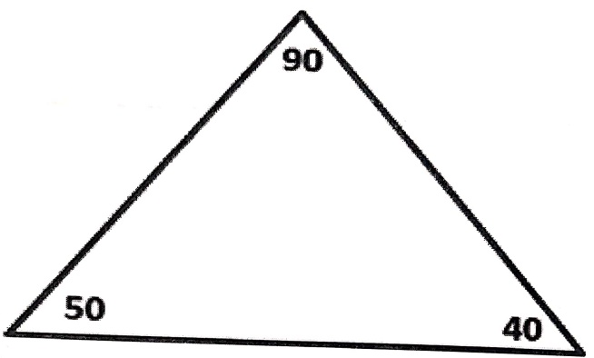

Addition statements

a. ___ + ___ = ___

b. ___ + ___ = ___

Subtraction statements

a. ___ - ___ = ___

b. ___ - ___ = ___

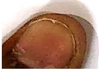

[Table 3](tables/table_003.html)

Date: ___

Some numbers are given below.

30

20

40

10

20

40

30

50

Circle the pair of numbers that result in the given sum and difference using same colour as the sum and difference.

a. Sum 30 and difference 10 ___

b. Sum 70 and difference 10 ___

c. Sum 50 and difference 10 ___

d. Sum 90 and difference 10 ___

[Table 4](tables/table_004.html)

Date _____

1. Direction: Solve the following:

a.

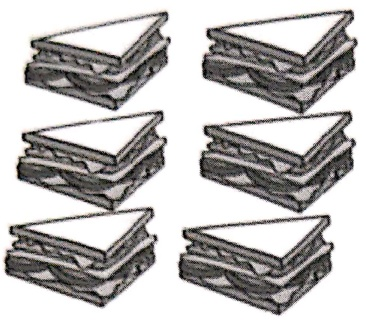

Sita made 3 sandwiches.

Rita made 3 more.

How many sandwiches in all?

b.

Priya brought 8 paper cups.

She lost 2 paper cups.

How many paper cups are left?

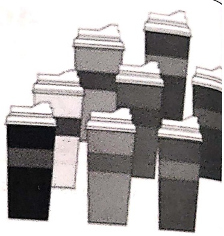

2. Look at the picture. Write + or – in the circle.

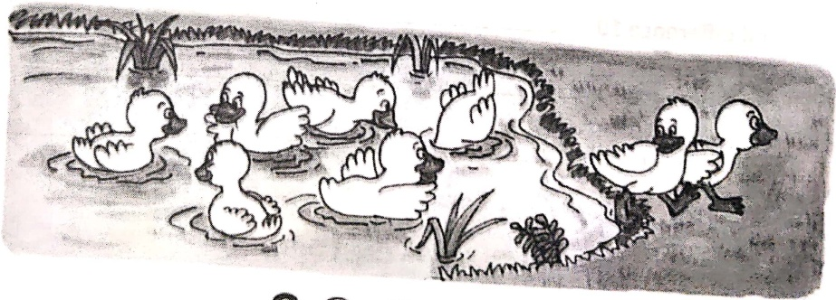

 $$ 8\bigcirc2=6 $$ 

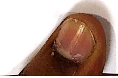

[Table 5](tables/table_005.html)

Date ___

3. Look at the picture. Write + or - in the circle.

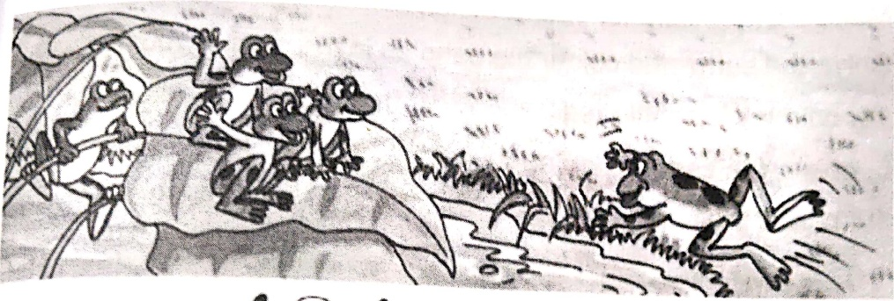

# 4○1=5

4. Put a symbol of + or - and solve the following:

a.

I had 9

I got 3 more.

How many rings do I have now?

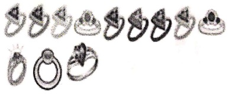

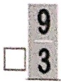

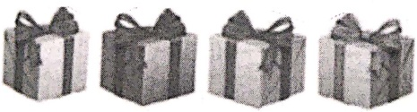

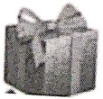

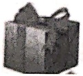

I got 4 gifts

I got 2 more

4

□2

How many in all?

I have 11 paint tubes.

llost5

How many do I have now?

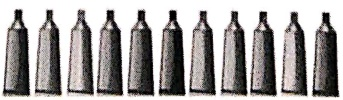

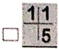

[Table 6](tables/table_006.html)

Date ___

Make a Diwali card for your teacher.

Solve the sums and colour the candles in the card. If your answer

14, colour the candle red.

5, colour the candle purple.

0, colour the candle green.

10, colour the candle blue.

12, colour the candle pink.

11, colour the candle yellow.

HAPPY DIWALI!

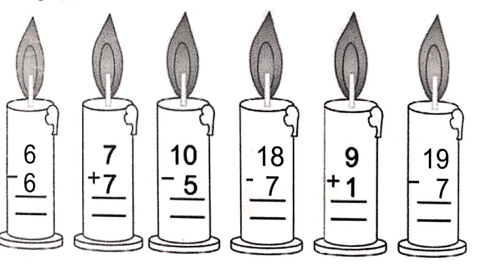

[Table 7](tables/table_007.html)

Date ___

Add the two numbers together to find the letters that spell out the secret words.

 $$ \begin{array}{r} 44 \\ + 53 \\ \hline 59 \end{array} $$ 

Write each letter in the given blanks.

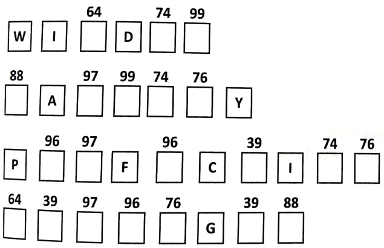

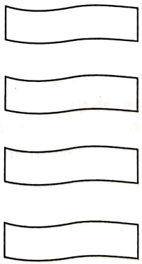

<table border=1 style='margin: auto; word-wrap: break-word;'><tr><td style='text-align: center; word-wrap: break-word;'>Grade: 1</td><td style='text-align: center; word-wrap: break-word;'>