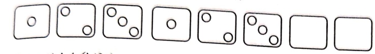
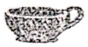
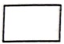
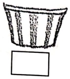
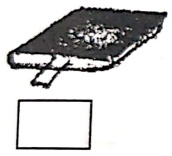
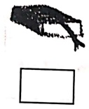

Subject: Maths</td><td style='text-align: center; word-wrap: break-word;'>Topic: Math Pre Skill</td></tr></table>

Date-___

Q.1. Complete the given pattern-

a)

b)

Q.2. Put a tick (✓) if the containers in the given pictures are full of water then which container will hold less water.

Q.3. Put a tick (✓) on the thicker and (×) on the thinner book.

Q.4. Look at the given data and answer the following questions.

[Table 1](tables/table_001.html)

How many cars were sold on Thursday?

Maximum number of cars were sold on

Minimum number of cars were sold on

) Total number of cars sold on Tuesday and Saturday _____

<table border=1 style='margin: auto; word-wrap: break-word;'><tr><td style='text-align: center; word-wrap: break-word;'>Grade: 1</td><td style='text-align: center; word-wrap: break-word;'>