Subject: Maths</td><td style='text-align: center; word-wrap: break-word;'>Topic: Timed Test</td></tr></table>

Date-___

Q1- Observe the picture and answer the following-

[Table 1](tables/table_001.html)

a) Which animal is on fifth position? _____

b) Which animal is on third position? ___

c) Lion is on _____ position.

d) Which animal is on first position? _____

Q2-Write the numbers and complete the subtraction number bonds:

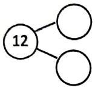

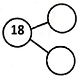

Q3-Solve:

7+2=___ is same as 2+___ = 9

[Table 2](tables/table_002.html)

Date-___

Q1-Fill in the blanks

a) _____ is the fifth month of the year.

b) February is the _____ month of the year.

Q2- Draw the circles as per the given statement and solve it through cross out method

9 - 5 = ___

Q3- Solve-

a) 7 - 3=___

c) 10 - 8=___

b) 14 - 6=___

d) 12-3=___

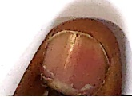

[Table 3](tables/table_003.html)

Date-___

Q1-Dodging-

a) 4X8 = ___

b)  $ 3 \times 6 = \_\_\_\_\_\_ $

Q2- How many tens and ones are there in-

a) 19-_____

Q3-Solve-

b) 44- $ \underline{\hspace{2cm}} $

3+4=___ is same as ___ + 3=7

[Table 4](tables/table_004.html)

[Table 5](tables/table_005.html)

Date-___

Q1-Add: -

a) $12 + 4 = $ ___

b)  $ 70 + 1 = \_\_\_ $

c)  $ 66 + 5 = $ _____

d)  $ 16 + 2 = \_\_\_\_\_\_ $

Q2-Dodging: -

a)  $ 3 \times 3 =  $ ___ b)  $ 4 \times 5 =  $ ___

c) \(2 \times 8 = \_\_\_\_\_\_) d) \(10 \times 7 = \_\_\_\_\_\_)

Q3-Write the expanded form of the given numbers-

a) 19-_____

c) 45-_____d) 38-_____

[Table 6](tables/table_006.html)

Date-___

Q1- Write the numbers to complete the addition number bonds-

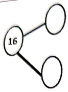

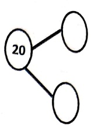

Q2-Write the expanded form of the given numbers-

[Table 7](tables/table_007.html)

Q3-Write the place value of the underlined digits-

a)26-

b)  $ \underline{3} $8-_____

[Table 8](tables/table_008.html)

Q1- Fill in the blanks

[Table 9](tables/table_009.html)

Q2-Solve-

a)13 + 5=___

b)26 + 1 = ___

Q3-Dodging-

c)  $ 25 + 0 = \_\_\_ $

d) 31 + 5=___

a)  $ 4 \times 4 = \_\_\_\_\_\_ $

b)2 × 6 = ___

c)  $ 3 \times 6 = \_\_\_\_\_ $

d)  $ 10 \times 5 = \_\_\_ $

[Table 10](tables/table_010.html)

Date-___

01- Write the expanded form of the given numbers-

[Table 11](tables/table_011.html)

Q2- Dodging-

a)  $ 2 \times 6 = $ _____

b)  $ 3 \times 3 = \_\_\_\_\_\_ $

c)  $ 3 \times 5 =  $ ___

Q3- Identify the place value of the given numbers and write them in the correct columns-

[Table 12](tables/table_012.html)

[Table 13](tables/table_013.html)

Date-

List two objects in your surroundings which are cuboid in shape.

b) ___

Fill in the missing number:

a)  $ 0^{+} $ = 8

Q3-Find the number that sums up to:

 $ a|  $ + = 10

Q4-Dodging:

[Table 14](tables/table_014.html)

[Table 15](tables/table_015.html)

Date-___

 $ \underline{\text{Q1. Dodging-}} $

a. 7×9=___

d.  $ 6 \times 6 = \_\_\_ $

b.  $ 8 \times 4 = \_\_\_ $

e. $9 \times 2 = $___

c.  $ 9 \times 5 = \_\_\_ $

f.  $ 8 \times 8 = \_\_\_\_\_\_ $

02. Solve-

a. $44+12=$___ c. $31+7=$___

b. 60-59=___

d. 58-8=___

Q3. Write the number that is: -

(3)4 tens + 6 ones = ___ b) 1 ten + 3 ones = ___

d) 7 tens + 7 ones = ___

Q4. The blackboard in the classroom has _____ corners.

[Table 16](tables/table_016.html)

Date-___

Q1-Solve-

a) 16 - 11 =  $ \boxed{1} $

c) 63 - 59 =  $ \boxed{1} $

b)  $ 10 + 0 = $  $ \Box $

d) 22 - 20 =  $ \boxed{2} $

Q2-Complete the following-

a) I have 3 sides and 3____. I am triangle.

b) I have 0 sides and 0 corners. I am _____

c) I have all 4 sides equal. I am _____

Q3-If you write number names from 1 to 10, which letter appears the most? ___

[Table 17](tables/table_017.html)

Date-___

Q1- Complete the table-

[Table 18](tables/table_018.html)

 $ \underline{\text{Q2- Fill in the blanks-}} $

a) _____ is just after 46. b) _____ is the fifth day of the week.

c) One less than 20 _____

d) 10 more than 67 is _____

Q3-If you reverse the digits in the number 59, what number do you get?

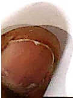

[Table 19](tables/table_019.html)

If today is last day of the week, what was day before yesterday? _____

Which number comes before 42 and after 40?

a) 39 b) 41 c) 42 d) 43

Solve-

a)  $ 28+4= $____ b)  $ 53-3= $____ c)  $ 39+1= $____

d)  $ 90+0= $____ e)  $ 8+11= $____ d)  $ 10-0= $____

Fill in the blanks-

What comes between Tuesday and Thursday? _____

b) What is place value of 3 in number 43?_____

c) Which is greater 4 tens or 4 ones? ___

d) Can we make a bundle of ten from 8 sticks? ___

[Table 20](tables/table_020.html)

一

Complete the addition sentences to make them doubles fact-

a) ___+___=2 b)8=___+___ c)5+___=10

If A=0 and B=10 then what will be A+B=___

If X=10 and Y=5 then what will be X+Y=___

Two tens and 4 ones make ___

86 has ___ tens and ___ ones.

Add-

a) 45+9=___ b) 58+4=___ c) 80+12=___

[Table 21](tables/table_021.html)

Date-___

Q1- Write the numbers in the correct column-

[Table 22](tables/table_022.html)

[Table 23](tables/table_023.html)

Q2-Solve-

[Table 24](tables/table_024.html)

[Table 25](tables/table_025.html)

[Table 26](tables/table_026.html)

[Table 27](tables/table_027.html)

Date-___

Q1- Write the numbers in the correct column according to their place value-

[Table 28](tables/table_028.html)

Q2- Colour the pictures to make a group of ten. Use different colours for different groups of ten:-

[Table 29](tables/table_029.html)

 $ \underline{\text{Q3-Dodging-}} $

a) 2×5=___

b)  $ 2 \times 8 =  $ ___

[Table 30](tables/table_030.html)

Date-___

Q1- Write the place value of the underlined digits: -

TO

TO

a)  $ \underline{33} $-_____

b) 6 $ \underline{8} $-_____

c)  $ \underline{20} $ _____

d)  $ \underline{1} $3- _____

#### Q2-Arrange the given set of numbers in ascending and descending order-

12 24 9

Ascending order _____

Descending order _____

Q3-Solve-

a)  $ 33 + 5 = \_\_\_ $

b)  $ 91 + 4 = \_\_\_ $

[Table 31](tables/table_031.html)

Date-___

Q1) Dodging:

a) 2 × 5=___

b)  $ 2 \times 7 =  $ _____

c)  $ 2 \times 9 = \_\_\_\_\_\_ $

d)  $ 3 \times 5 = \_\_\_\_\_\_ $

Q2) Add: -

a) 43 + 4=___

b) 75+0=___

Q3) Write what comes before, after and in between: -

a) 27 ___

b) ___ 49

c) 98 ___ 100

d) 35 ___

[Table 32](tables/table_032.html)

Date-___

Q1- Fill in the missing number to complete the statements -

a.  $ \_\_\_ $ +  $ \_\_\_ $ = 18

c.  $ \_\_\_\_\_ $ + 6 = 12

b.  $ \underline{\hspace{2em}}5=10 $

d. 8 - ___ = 4

Q2.  $ \underline{\text{Solve-}} $

a.  $ 33+8= $ _____

d. 55-4=___

b. 42-39=___

e.92+2=___

c. 71+6=___

f. 13-0 = ___

Q3- Write the number that is: -

a) 4 tens + 6 ones = ___ b) 1 ten + 3 ones = ___

c) 6 tens + 4 ones = ___ d) 7 tens + 7 ones = ___

Q4-There are ___ students in your class, out of which 10 are absent and ___ are present.

[Table 33](tables/table_033.html)

Date-___

Q1-Fill in the blanks-

a) 2 less than 18 is ___ b)  $ 5+8=8+ $ ___ =13

c) 10 more than 40 is ___

d) There are ___ colours in the rainbow.

Q2-Arrange the following numbers in ascending and descending order -

a) 12,4,78,18,56

AO-___

DO-___

b) 45, 6, 21, 21, 87

AO-___

DO-___

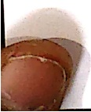

[Table 34](tables/table_034.html)

Practice Sheet : 1

Date: ___

Q1- Dodging-

a) $2 \times 2 = $ ___

c)  $ 5 \times 2 = \_\_\_ $

b)  $ 5 \times 5 = \_\_\_ $

d)  $ 2 \times 5 = \_\_\_ $

Q2-Complete the following-

a) 38 ___ 40

c) 72 ___

b) 78 ____

d) ___ 62

Q3-Count by 10's and fill in the boxes with the missing numbers-

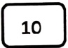

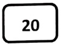

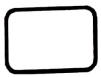

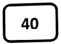

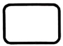

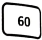

[Table 35](tables/table_035.html)

practice Sheet : 3

Date: ___

Q1-Arrange the given numbers in ascending order-

[Table 36](tables/table_036.html)

Q2-Write the number name for the given numbers-

a) 16-___

c) 14-___

b) 13-___

d) 19-___

Q3-What comes before, after and in between-

a)____ 25 ____

c) 36___

b) 18_____20

d) ___ 41

[Table 37](tables/table_037.html)

Practice Sheet : 4

Date-___

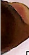

Q1-Arrange the given numbers in descending order-

[Table 38](tables/table_038.html)

Q2-Count by 2's and fill in the blanks with the missing numbers-

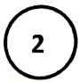

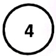

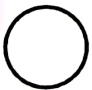

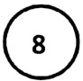

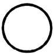

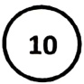

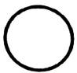

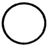

Q3-Write the numeral for the given number names-

a) eighteen-___

b) twelve-_____

<table border=1 style='margin: auto; word-wrap: break-word;'><tr><td style='text-align: center; word-wrap: break-word;'>Grade: 1</td><td style='text-align: center; word-wrap: break-word;'>