Subject: Maths</td><td style='text-align: center; word-wrap: break-word;'>Topic: Logical Reasoning</td></tr></table>

When a number is put into a machine, a different number comes out. If 9 goes in, 4 comes out. If 11 goes in, 6 comes out. If 12 goes in 7 comes out. If 14 goes in, what number should come out?

There are equal number of books in each carton, if there are 5 books in 1 carton, 5 books in the  $ 2^{nd} $ carton, 5 books in the  $ 3^{rd} $ carton, how many books will be there in the carton?

3. Sia's aunt lived in an apartment with 5 floors. She could climb till the 2 $ ^{nd} $ floor and got tired, how many floors more does she need to climb?

4. In a book page 1 is blank, page 2 is printed, page 3 is blank, page 4 is printed and this continues till the end of the book. Then the next two printed pages will be _____ and _____

5. Mayur read 32 pages of a book but he still has 7 more pages to read. Find the total number of pages in the book.

_____

[Table 1](tables/table_001.html)

### Worksheet 5

Date: ___

Cross (x) out the object which does not fit into the pattern :

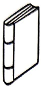

a)

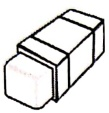

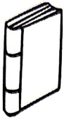

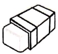

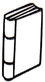

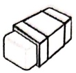

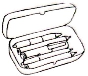

b)
 

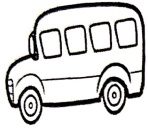

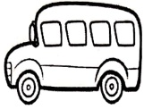

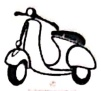

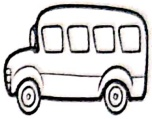

c)

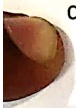

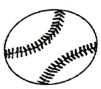

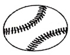

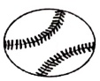

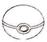

d)
 

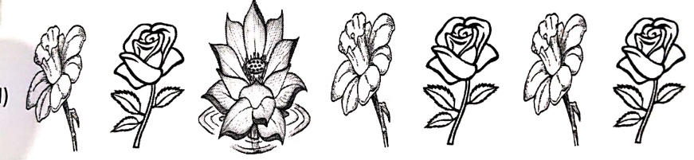

e)
 

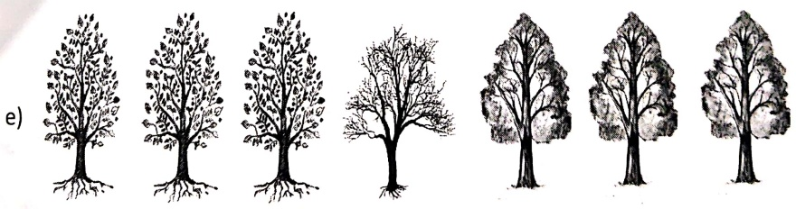

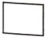

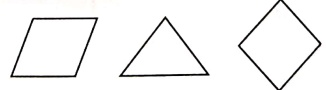

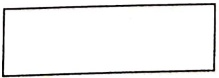

g)

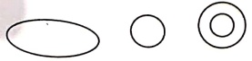

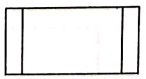

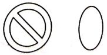

[Table 2](tables/table_002.html)

1. What is the sum of first 5 counting numbers?

a) 15 b) 16 c) 5 d) 14

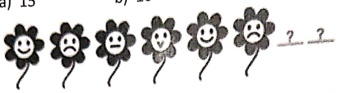

2. Find the next figure in the figure pattern given below

A)

B)

C)

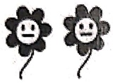

D)
 

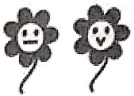

3. 6th ice-cream is before ice-cream____.

a) E b) D c) G d) B

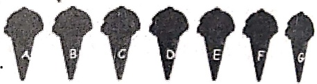

4. Which figure will complete the given figure?

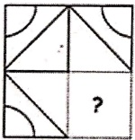

a)

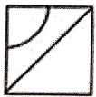

b)

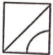

c)

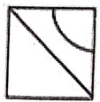

d)
 

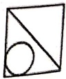

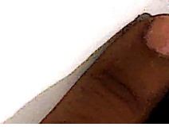

<table border=1 style='margin: auto; word-wrap: break-word;'><tr><td style='text-align: center; word-wrap: break-word;'>Grade: 1</td><td style='text-align: center; word-wrap: break-word;'>