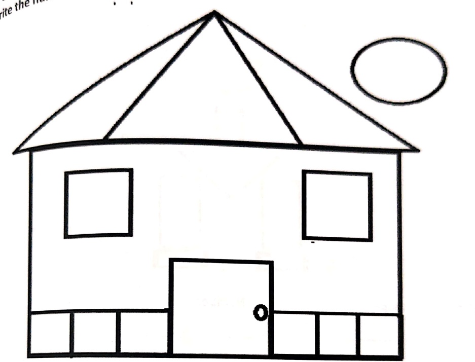
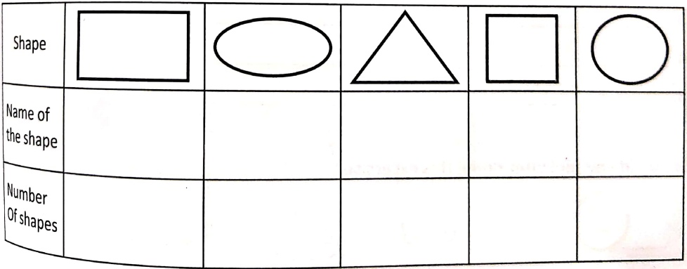
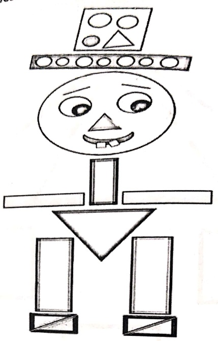
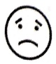
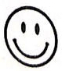
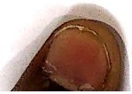
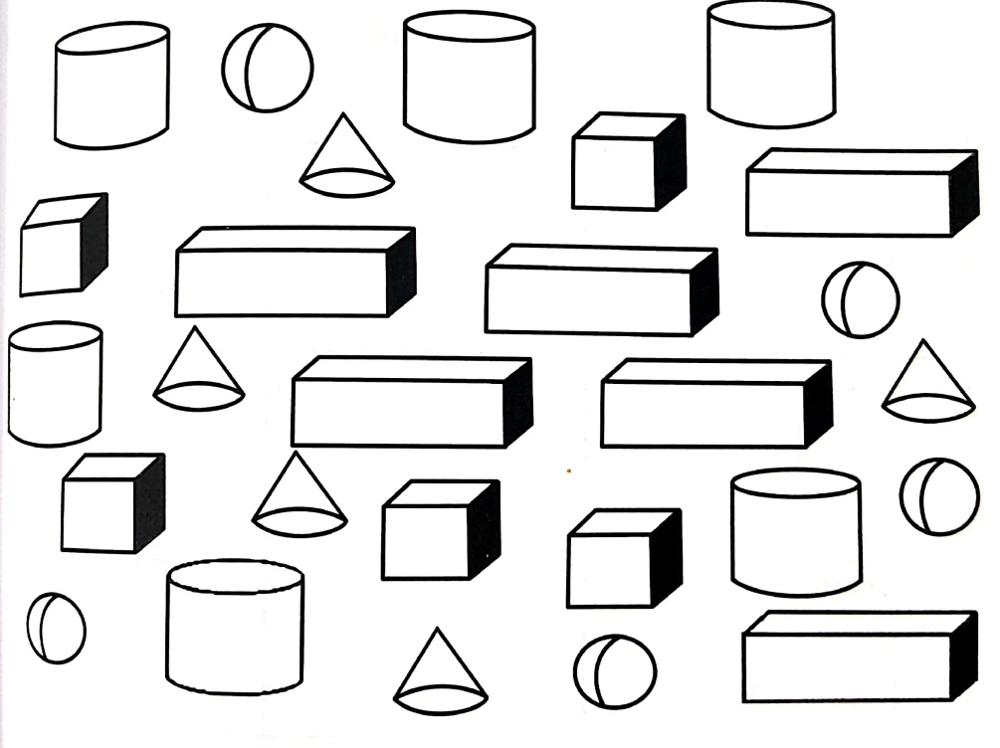

Subject: Maths</td><td style='text-align: center; word-wrap: break-word;'>Topic: Shapes and Spaces</td></tr></table>

Date: ___

1. Colour the triangles red, circle pink, squares green, rectangles blue and oval yellow

[Table 1](tables/table_001.html)

Date: ___

Count the number of shapes and write their names. Colour all the shapes.

Name of the shape

Number

1. ___

2. _____

3. ___

——

4. _____

5._____

How did you feel after doing this exercise?

[Table 2](tables/table_002.html)

Date:___

Name the shape:

[Table 3](tables/table_003.html)

1) Colour the cubes pink, cylinders blue, cones orange, cuboids green and spheres yellow.

<table border=1 style='margin: auto; word-wrap: break-word;'><tr><td style='text-align: center; word-wrap: break-word;'>Grade: 1</td><td style='text-align: center; word-wrap: break-word;'>