Subject: Maths</td><td style='text-align: center; word-wrap: break-word;'></td></tr></table>

Date:___

Find an object in your house that looks like each of the following shapes.

[Table 1](tables/table_001.html)

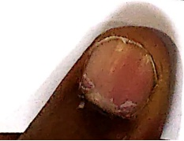

[Table 2](tables/table_002.html)

Date: ___

Look at the example & tick (√) the object that is the longest/ shortest

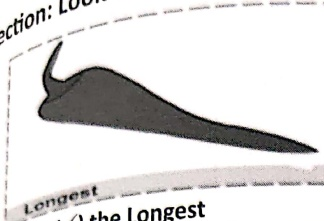

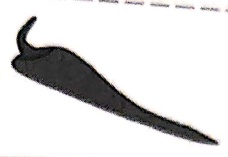

Tick (✓) the Longest

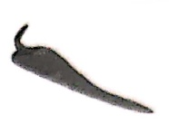

a.
 

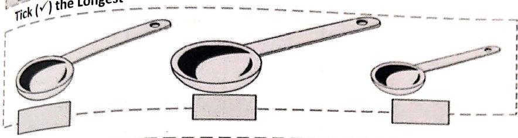

b.
 

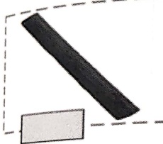

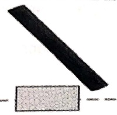

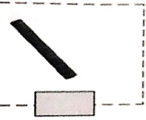

Tick (✓) the Shortest

directions: Look at the example & tick (✓) the object that is the thickest/ thinnest.

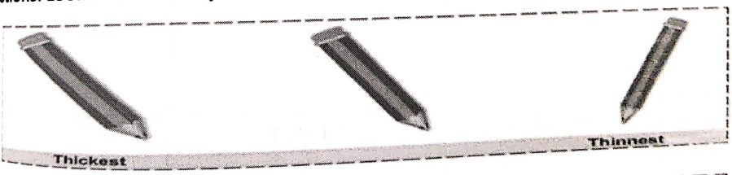

3
 

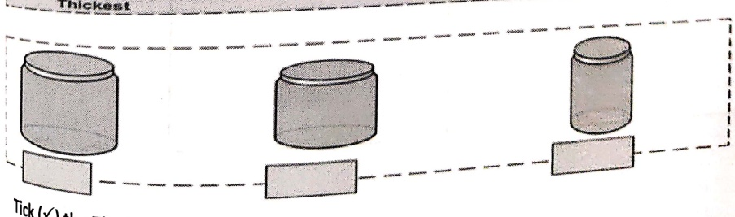

Tick (√) the Thickest

[Table 3](tables/table_003.html)

Date: ___

Directions: Fill in the observations in the given table

[Table 4](tables/table_004.html)

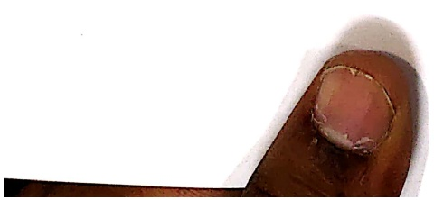

[Table 5](tables/table_005.html)

Date:___

Direction: Fill in the observations in the given table

[Table 6](tables/table_006.html)

[Table 7](tables/table_007.html)

Date: _____

Direction: Draw and colour the objects starting from the biggest to the smallest

[Table 8](tables/table_008.html)

Direction: Draw and colour the objects starting from the shortest to the longest.

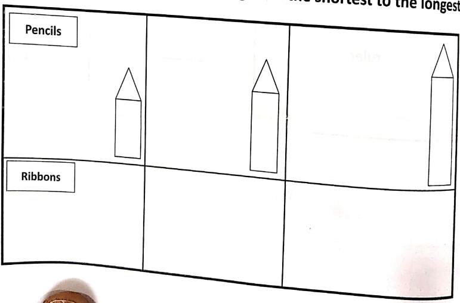

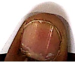

[Table 9](tables/table_009.html)

Date: ___

direction: Use pan balance & circle the objects that are heavier.

[Table 10](tables/table_010.html)

[Table 11](tables/table_011.html)

Date: ___

Direction: Show by drawing objects that -

[Table 12](tables/table_012.html)

<table border=1 style='margin: auto; word-wrap: break-word;'><tr><td style='text-align: center; word-wrap: break-word;'></td><td style='text-align: center; word-wrap: break-word;'>