Subject: Maths</td><td style='text-align: center; word-wrap: break-word;'>Topic: Patterns</td></tr><tr><td style='text-align: center; word-wrap: break-word;'>Grade: 1</td><td colspan="2"></td></tr></table>

Date: ___

Observe and complete the pattern by colouring.

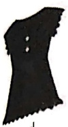

red

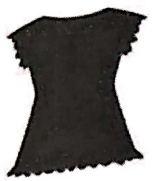

blue

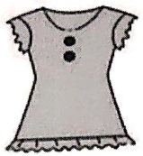

yellow

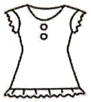

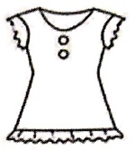

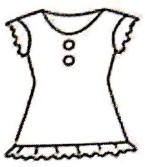

green

orange

pink

black

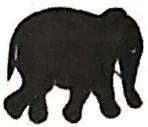

black

grey

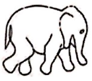

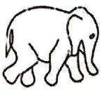

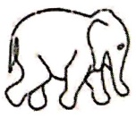

Let's practice with some number patterns.

[Table 1](tables/table_001.html)

[Table 2](tables/table_002.html)

Date:___

Draw the next three to complete each pattern.

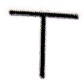

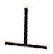

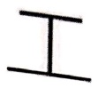

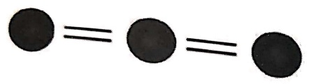

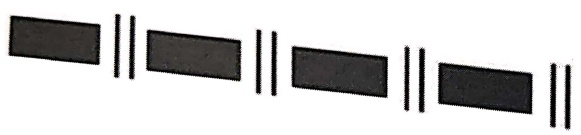

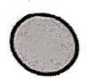

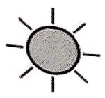

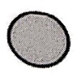

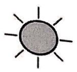

[Table 3](tables/table_003.html)

<table border=1 style='margin: auto; word-wrap: break-word;'><tr><td style='text-align: center; word-wrap: break-word;'>Grade: 1</td><td style='text-align: center; word-wrap: break-word;'>