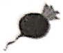
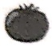
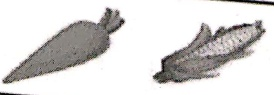
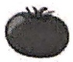
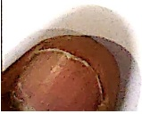
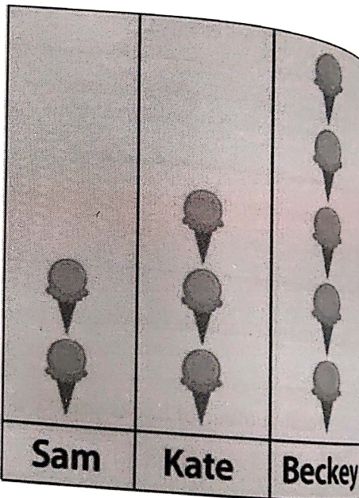
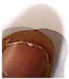

Subject: Maths</td><td style='text-align: center; word-wrap: break-word;'>Topic: Data Handling</td></tr></table>

[Table 1](tables/table_001.html)

Direction: Using the table given below, draw the objects on the picture graph.

[Table 2](tables/table_002.html)

[Table 3](tables/table_003.html)

Date:___

## Robbie Rabbit's Garden Graph

Help Mr. Rabbit count his vegetables by creating a bar graph. Colour in the correct number of boxes for each vegetable. The first vegetable has been done for you.

5 Radishes

9 Carrots

7 Tomatoes

6 Corns

3 Cauliflowers

4 Mushrooms

[Table 4](tables/table_004.html)

[Table 5](tables/table_005.html)

collect the following data:

[Table 6](tables/table_006.html)

[Table 7](tables/table_007.html)

Date:___

#### ICE CREAM FOR SALE!

#### SAM, KATE AND BECKY ARE SELLING ICE CREAM CONES.

## 1. Use the chart below to fill in the blanks

[Table 8](tables/table_008.html)

a. Who sold the most ice-cream cones? _____

b. Who sold the least ice-cream cones? _____

c. How many more ice-cream cones did Becky sell than Sam?

d. How many ice-cream cones were sold in all? _____

<table border=1 style='margin: auto; word-wrap: break-word;'><tr><td style='text-align: center; word-wrap: break-word;'>Grade:1</td><td style='text-align: center; word-wrap: break-word;'>