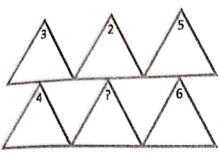
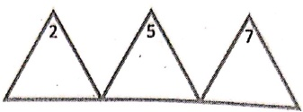
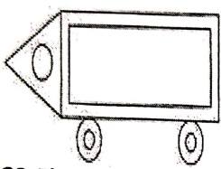

Subject: Maths</td><td style='text-align: center; word-wrap: break-word;'>Topic: Pre-Skill</td></tr></table>

Q5.I planted 5 saplings on Monday. 3 saplings on Tuesday and 3 saplings on Wednesday.

How many saplings did I plant altogether?

A) 15

B) 11

C) 13

Q6.

Select the correct option, according to each question.

[Table 1](tables/table_001.html)

[Table 2](tables/table_002.html)

Q1. What is the missing number in the given pattern?

a)1

b)2

c)3

d)4

Q2. The shape missing in the given figure is ___.

A) square

B) circle

Q3. Which number comes in the given pattern?

5,10,15,20,25,30,35,40, ___?

A) 50

B) 45

Q4. 50 cups on my head 1 fell down how many left?

A. 50 B. 49 C. 51

<table border=1 style='margin: auto; word-wrap: break-word;'><tr><td style='text-align: center; word-wrap: break-word;'>Grade: 1</td><td style='text-align: center; word-wrap: break-word;'>