Subject: Maths</td><td style='text-align: center; word-wrap: break-word;'>Topic: Revision</td></tr></table>

#### Worksheet 4

Date: ___

 $ \underline{\text{Find the sum}} $:

a)

 $$ \begin{array}{ccc}3+5&+&\underbrace{1}\\ \Box&+&\boxed{\quad}=\quad\boxed{\quad}\end{array} $$ 

b)

 $$ \begin{array}{ccc}4+6&+&\underbrace{3}\\ \Box&+&\boxed{\quad}=\quad\boxed{\quad}\end{array} $$ 

c)

 $$ \begin{array}{ccc}7+1&+&\underbrace{4}\\ \Box&+&\boxed{\quad}= \end{array}\quad\Box $$ 

d)

 $$ \begin{array}{ccc}5+1&+&\underbrace{6}\\ \Box&+&\boxed{\quad}=\\\end{array} $$ 

e)

 $$ \begin{array}{ccc}5+2&+&\underbrace{4}\\ \Box&+&\Box\\ \end{array}=\boxed{\boxed{}} $$ 

f)

 $$ \begin{array}{ccc}1\overset{+}{}&+&8\\&&\hdots\\&\boxed{\quad}&+&{\boxed{\quad}=\quad\boxed{\quad}}\end{array} $$ 

g)

 $$ \begin{array}{ccc}7+4&+&\underbrace{2}\\ \Box&+&\Box\\ \end{array}=\underline{\quad} $$ 

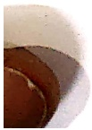

[Table 1](tables/table_001.html)

practice Worksheet 1

Date: ___

### Q.1  $ \underline{\text{Draw images and cross out to subtract:}} $

a. 7 caps - 2 caps = _____ caps.

[Table 2](tables/table_002.html)

b. 10 pencils - 7 pencils = ___ pencils.

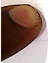

Q.2  $ \underline{\text{Subtract}} $:

 $$ \begin{array}{c}T\\8\quad6\\-\underline{1\quad5}\underline{\quad}\end{array} $$ 

 $$ \begin{aligned}&b.T\quad O\\&\quad7\quad7\\&-\underline{2\quad3}\\&\quad\underline{\quad}\end{aligned} $$ 

 $$ \begin{aligned}&\begin{matrix}c.T&O\\&6&5\\-&\underline{1}&0\\\end{matrix}\\ &\underline{\quad}\\ \end{aligned} $$ 

 $$ \begin{aligned}d.T\quad&O\\ 7\quad&6\\ -\underline{4\quad}&6\\ \underline{\quad}&\end{aligned} $$ 

[Table 3](tables/table_003.html)

Q.3  $ \underline{\text{Solve the problems}} $:

a. Sam has 8 boxes.

He gives 5 boxes to his sister.

How many boxes are left with him?

___

b. There are 9 birds sitting on the tree.

5 birds flew away.

How many birds are left?

___

Q.4  $ \underline{\text{Solve}} $

a. 46-36=___

c. 22-18=___

b. 55-48=___

d. 89-88=___

e. 77-70=___

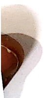

f. 69-59=___

g. 11- 9= ___

h.32-27=___

[Table 4](tables/table_004.html)

Practice Worksheet 2

Date: ___

### Q.1 Subtract the following using the ball:

a. 18-7=___

___

广

b. 19-5=___

欽定四庫全書

卷一

卷二

卷三

卷四

卷五

卷六

卷七

卷八

卷九

卷十

卷十一

卷十二

卷十三

卷十四

卷十五

卷十六

卷十七

卷十八

卷十九

卷二十

卷二十一

卷二十二

卷二十三

卷二十四

卷二十五

卷二十六

卷二十七

卷二十八

卷二十九

卷三十

卷三十一

卷三十二

卷三十三

卷三十四

卷三十五

卷三十六

卷三十七

卷三十八

卷三十九

卷四十

卷五

卷六

卷七

卷八

卷九

卷十

卷十一

卷十二

卷十三

卷十四

卷十五

卷十六

卷十七

卷十八

卷十九

卷二十

卷二十二

卷二十三

卷二十四

卷二十五

卷二十六

卷二十七

卷二十八

卷二十九

卷三十

卷三十一

卷三十二

卷三十三

卷三十四

卷三十五

卷三十六

卷三十七

卷三十八

卷三十九

卷四十

卷五

卷六

卷七

卷八

卷九

卷十

卷十一

卷十二

卷十三

卷十四

卷十五

卷十六

卷十七

卷十八

卷十九

卷二十

卷二十二

卷二十三

卷二十四

卷二十五

卷二十六

卷二十七

卷二十八

卷二十九

卷三十

卷三十一

卷三十二

卷三十三

卷三十四

卷三十五

卷三十六

卷三十七

卷三十八

卷三十九

卷四十

卷五

卷六

卷七

卷八

卷九

卷十

卷十一

卷十二

卷十三

卷十四

卷十五

卷十六

卷十七

卷十八

卷十九

卷二十

卷二十二

卷二十四

卷二十五

卷二十六

卷二十七

卷二十八

卷二十九

卷三十

卷三十一

卷三十二

卷三十三

卷三十四

卷三十五

卷三十六

卷三十七

卷三十八

卷三十九

卷四十

卷五

卷六

卷七

卷八

卷九

卷十

卷十一

卷十二

卷十三

卷十四

卷十五

卷十六

卷十七

卷十八

卷十九

卷二十

卷二十二

卷二十四

卷二十五

卷二十六

卷二十七

卷二十八

卷二十九

卷三十

卷三十一

卷三十二

卷三十三

卷三十四

卷三十五

卷三十六

卷三十七

卷三十八

卷三十九

卷四十

卷五

卷六

卷七

卷八

卷九

卷十

卷十一

卷十二

卷十三

卷十四

卷十五

卷十六

卷十七

卷十八

卷十九

卷二十

卷二十二

卷二十四

卷二十五

卷二十六

卷二十七

卷二十八

卷二十九

卷三十

卷三十一

卷三十二

卷三十三

卷三十四

卷三十五

卷三十六

卷三十七

卷三十八

卷三十九

卷四十

卷五

卷六

卷七

卷八

卷九

卷十

卷十一

卷十二

卷十三

卷十四

卷十五

卷十六

卷十七

卷十八

卷十九

卷二十

卷二十二

卷二十四

卷二十五

卷二十六

卷二十七

卷二十八

卷二十九

卷三十

卷三十一

卷三十二

卷三十三

卷三十四

卷三十五

卷三十六

卷三十七

卷三十八

卷三十九

卷四十

卷五

卷六

卷七

卷八

卷九

卷十

卷十一

卷十二

卷十三

卷十四

卷十五

卷十六

卷十七

卷十八

卷十九

卷二十

卷二十二

卷二十四

卷二十五

卷二十六

卷二十七

卷二十八

卷二十九

卷三十

卷三十一

卷三十二

卷三十三

卷三十四

卷三十五

卷三十六

卷三十七

卷三十八

卷三十九

卷四十

卷五

卷六

卷七

卷八

卷九

卷十

卷十一

卷十二

卷十三

卷十四

卷十五

卷十六

卷十七

卷十八

卷十九

卷二十

卷二十二

卷二十四

卷二十五

卷二十六

卷二十七

卷二十八

卷二十九

卷三十

卷三十一

卷三十二

卷三十三

卷三十四

卷三十五

卷三十六

卷三十七

卷三十八

卷三十九

卷四十

卷五

卷六

卷七

卷八

卷九

卷十

卷十一

卷十二

卷十三

卷十四

卷十五

卷十六

卷十七

卷十八

卷十九

卷二十

卷二十二

卷二十四

卷二十五

卷二十六

卷二十七

卷二十八

卷二十九

卷三十

卷三十一

卷三十二

卷三十三

卷三十四

卷三十五

卷三十六

卷三十七

卷三十八

卷三十九

卷四十

卷五

卷六

卷七

卷八

卷九

卷十

卷十一

卷十二

卷十三

卷十四

卷十五

卷十六

卷十七

卷十八

卷十九

卷二十

卷二十二

卷二十四

卷二十五

卷二十六

卷二十七

卷二十八

卷二十九

卷三十

卷三十一

卷三十二

卷三十三

卷三十四

卷三十五

卷三十六

卷三十七

卷三十八

卷三十九

卷四十

卷五

卷六

卷七

卷八

卷九

卷十

卷十一

卷十二

卷十三

卷十四

卷十五

卷十六

卷十七

卷十八

卷十九

卷二十

卷二十二

卷二十四

卷二十五

卷二十六

卷二十七

卷二十八

卷二十九

卷三十

卷三十一

卷三十二

卷三十三

卷三十四

卷三十五

卷三十六

卷三十七

卷三十八

卷三十九

卷四十

卷五

卷六

卷七

卷八

卷九

卷十

卷十一

卷十二

卷十三

卷十四

卷十五

卷十六

卷十七

卷十八

卷十九

卷二十

卷二十二

卷二十四

卷二十五

卷二十六

卷二十七

卷二十八

卷二十九

卷三十

卷三十一

卷三十二

卷三十三

卷三十四

卷三十五

卷三十六

卷三十七

卷三十八

卷三十九

卷四十

卷五

卷六

卷七

卷八

卷九

卷十

卷十一

卷十二

卷十三

卷十四

卷十五

卷十六

卷十七

卷十八

卷十九

卷二十

卷二十二

卷二十四

卷二十五

卷二十六

卷二十七

卷二十八

卷二十九

卷三十

卷三十一

卷三十二

卷三十三

卷三十四

卷三十五

卷三十六

卷三十七

卷三十八

卷三十九

卷四十

卷五

卷六

卷七

卷八

卷九

卷十

卷十一

卷十二

卷十三

卷十四

卷十五

卷十六

卷十七

卷十八

卷十九

卷二十

卷二十二

卷二十四

卷二十五

卷二十六

卷二十七

卷二十八

卷二十九

卷三十

卷三十一

卷三十二

卷三十三

卷三十四

卷三十五

卷三十六

卷三十七

卷三十八

卷三十九

卷四十

卷五

卷六

卷七

卷八

卷九

卷十

卷十一

卷十二

卷十三

卷十四

卷十五

卷十六

卷十七

卷十八

卷十九

卷二十

卷二十二

卷二十四

卷二十五

卷二十六

卷二十七

卷二十八

卷二十九

卷三十

卷三十一

卷三十二

卷三十三

卷三十四

卷三十五

卷三十六

卷三十七

卷三十八

卷三十九

卷四十

卷五

卷六

卷七

卷八

卷九

卷十

卷十一

卷十二

卷十三

卷十四

卷十五

卷十六

卷十七

卷十八

卷十九

卷二十

卷二十二

卷二十四

卷二十五

卷二十六

卷二十七

卷二十八

卷二十九

卷三十

卷三十一

卷三十二

卷三十三

卷三十四

卷三十五

卷三十六

卷三十七

卷三十八

卷三十九

卷四十

卷五

卷六

卷七

卷八

卷九

卷十

卷十一

卷十二

卷十三

卷十四

卷十五

卷十六

卷十七

卷十八

卷十九

卷二十

卷二十二

卷二十四

卷二十五

卷二十六

卷二十七

卷二十八

卷二十九

卷三十

卷三十一

卷三十二

卷三十三

卷三十四

卷三十五

卷三十六

卷三十七

卷三十八

卷三十九

卷四十

卷五

卷六

卷七

卷八

卷九

卷十

卷十一

卷十二

卷十三

卷十四

卷十五

卷十六

卷十七

卷十八

卷十九

卷二十

卷二十二

卷二十四

卷二十五

卷二十六

卷二十七

卷二十八

卷二十九

卷三十

卷三十一

卷三十二

卷三十三

卷三十四

卷三十五

卷三十六

卷三十七

卷三十八

卷三十九

卷四十

卷五

卷六

卷七

卷八

卷九

卷十

卷十一

卷十二

卷十三

卷十四

卷十五

卷十六

卷十七

卷十八

卷十九

卷二十

卷二十二

卷二十四

卷二十五

卷二十六

卷二十七

卷二十八

卷二十九

卷三十

卷三十一

卷三十二

卷三十三

卷三十四

卷三十五

卷三十六

卷三十七

卷三十八

卷三十九

卷四十

卷五

卷六

卷七

卷八

卷九

卷十

卷十一

卷十二

卷十三

卷十四

卷十五

卷十六

卷十七

卷十八

卷十九

卷二十

卷二十二

卷二十四

卷二十五

卷二十六

卷二十七

卷二十八

卷二十九

卷三十

卷三十一

卷三十二

卷三十三

卷三十四

卷三十五

卷三十六

卷三十七

卷三十八

卷三十九

卷四十

卷五

卷六

卷七

卷八

卷九

卷十

卷十一

卷十二

卷十三

卷十四

卷十五

卷十六

卷十七

卷十八

卷十九

卷二十

卷二十二

卷二十四

卷二十五

卷二十六

卷二十七

卷二十八

卷二十九

卷三十

卷三十一

卷三十二

卷三十三

卷三十四

卷三十五

卷三十六

卷三十七

卷三十八

卷三十九

卷四十

卷五

卷六

卷七

卷八

卷九

卷十

卷十一

卷十二

卷十三

卷十四

卷十五

卷十六

卷十七

卷十八

卷十九

卷二十

卷二十二

卷二十四

卷二十五

卷二十六

卷二十七

卷二十八

卷二十九

卷三十

卷三十一

卷三十二

卷三十三

卷三十四

卷三十五

卷三十六

卷三十七

卷三十八

卷三十九

卷四十

卷五

卷六

卷七

卷八

卷九

卷十

卷十一

卷十二

卷十三

卷十四

卷十五

卷十六

卷十七

卷十八

卷十九

卷二十

卷二十二

卷二十四

卷二十五

卷二十六

卷二十七

卷二十八

卷二十九

卷三十

卷三十一

卷三十二

卷三十三

卷三十四

卷三十五

卷三十六

卷三十七

卷三十八

卷三十九

卷四十

卷五

卷六

卷七

卷八

卷九

卷十

卷十一

卷十二

卷十三

卷十四

卷十五

卷十六

卷十七

卷十八

卷十九

卷二十

卷二十二

卷二十四

卷二十五

卷二十六

卷二十七

卷二十八

卷二十九

卷三十

卷三十一

卷三十二

卷三十三

卷三十四

卷三十五

卷三十六

卷三十七

卷三十八

卷三十九

卷四十

卷五

卷六

卷七

卷八

卷九

卷十

卷十一

卷十二

卷十三

卷十四

卷十五

卷十六

卷十七

卷十八

卷十九

卷二十

卷二十二

卷二十四

卷二十五

卷二十六

卷二十七

卷二十八

卷二十九

卷三十

卷三十一

卷三十二

卷三十三

卷三十四

卷三十五

卷三十六

卷三十七

卷三十八

卷三十九

卷四十

卷五

卷六

卷七

卷八

卷九

卷十

卷十一

卷十二

卷十三

卷十四

卷十五

卷十六

卷十七

卷十八

卷十九

卷二十

卷二十二

卷二十四

卷二十五

卷二十六

卷二十七

卷二十八

卷二十九

卷三十

卷三十一

卷三十二

卷三十三

卷三十四

卷三十五

卷三十六

卷三十七

卷三十八

卷三十九

卷四十

卷五

卷六

卷七

卷八

卷九

卷十

卷十一

卷十二

卷十三

卷十四

卷十五

卷十六

卷十七

卷十八

卷十九

卷二十

卷二十二

卷二十四

卷二十五

卷二十六

卷二十七

卷二十八

卷二十九

卷三十

卷三十一

卷三十二

卷三十三

卷三十四

卷三十五

卷三十六

卷三十七

卷三十八

卷三十九

卷四十

卷五

卷六

卷七

卷八

卷九

卷十

卷十一

卷十二

卷十三

卷十四

卷十五

卷十六

卷十七

卷十八

卷十九

卷二十

卷二十二

卷二十四

卷二十五

卷二十六

卷二十七

卷二十八

卷二十九

卷三十

卷三十一

卷三十二

卷三十三

卷三十四

卷三十五

卷三十六

卷三十七

卷三十八

卷三十九

卷四十

卷五

卷六

卷七

卷八

卷九

卷十

卷十一

卷十二

卷十三

卷十四

卷十五

卷十六

卷十七

卷十八

卷十九

卷二十

卷二十二

卷二十四

卷二十五

卷二十六

卷二十七

卷二十八

卷二十九

卷三十

卷三十一

卷三十二

卷三十三

卷三十四

卷三十五

卷三十六

卷三十七

卷三十八

卷三十九

卷四十

卷五

卷六

卷七

卷八

卷九

卷十

卷十一

卷十二

卷十三

卷十四

卷十五

卷十六

卷十七

卷十八

卷十九

卷二十

卷二十二

卷二十四

卷二十五

卷二十六

卷二十七

卷二十八

卷二十九

卷三十

卷三十一

卷三十二

卷三十三

卷三十四

卷三十五

卷三十六

卷三十七

卷三十八

卷三十九

卷四十

卷五

卷六

卷七

卷八

卷九

卷十

卷十一

卷十二

卷十三

卷十四

卷十五

卷十六

卷十七

卷十八

卷十九

卷二十

卷二十二

卷二十四

卷二十五

卷二十六

卷二十七

卷二十八

卷二十九

卷三十

卷三十一

卷三十二

卷三十三

卷三十四

卷三十五

卷三十六

卷三十七

卷三十八

卷三十九

卷四十

卷五

卷六

卷七

卷八

卷九

卷十

卷十一

卷十二

卷十三

卷十四

卷十五

卷十六

卷十七

卷十八

卷十九

卷二十

卷二十二

卷二十四

卷二十五

卷二十六

卷二十七

卷二十八

卷二十九

卷三十

卷三十一

卷三十二

卷三十三

卷三十四

卷三十五

卷三十六

卷三十七

卷三十八

卷三十九

卷四十

卷五

卷六

卷七

卷八

卷九

卷十

卷十一

卷十二

卷十三

卷十四

卷十五

卷十六

卷十七

卷十八

卷十九

卷二十

卷二十二

卷二十四

卷二十五

卷二十六

卷二十七

卷二十八

卷二十九

卷三十

卷三十一

卷三十二

卷三十三

卷三十四

卷三十五

卷三十六

卷三十七

卷三十八

卷三十九

卷四十

卷五

卷六

卷七

卷八

卷九

卷十

卷十一

卷十二

卷十三

卷十四

卷十五

卷十六

卷十七

卷十八

卷十九

卷二十

卷二十二

卷二十四

卷二十五

卷二十六

卷二十七

卷二十八

卷二十九

卷三十

卷三十一

卷三十二

卷三十三

卷三十四

卷三十五

卷三十六

卷三十七

卷三十八

卷三十九

卷四十

卷五

卷六

卷七

卷八

卷九

卷十

卷十一

卷十二

卷十三

卷十四

卷十五

卷十六

Q.2 Dodging:

[Table 5](tables/table_005.html)

[Table 6](tables/table_006.html)

Practice Worksheet 3

Date: ___

### Q.1. Solve the sums:

[Table 7](tables/table_007.html)

### Q.2. Solve:

[Table 8](tables/table_008.html)

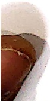

[Table 9](tables/table_009.html)

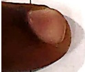

# Winter Vacation Home Work Topics: Numbers, Addition, Subtraction, Tables

Date: ___

1. Unscramble the letters to form number names and write in column A and match them to the numbers in column B

[Table 10](tables/table_010.html)

### Q.2 Circle the number that is:

A: Greater than: -

(a) 28

16 92 63

B: Smaller than: -

(a) 91

90 92 95

Q.3 Fill in the blanks.

a) 43 comes after _____.

b) 13 comes before_____.

c) _____ comes between 57 and 59.

d) _____ comes after 3.

e) 2 less than 88 is _____.

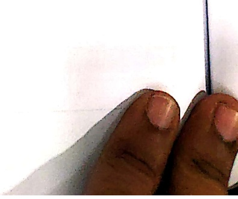

Q.4 Fill in the missing numbers: -

a. 10, 20, 30, ___, ___, 60.

b. 5,10, __, __, __, __, __, 30.

c. 2, ___ , ___ , 8, ___ , ___ .

d. 40, ___, ___, 70, ___, ___.

Q.5. Solve

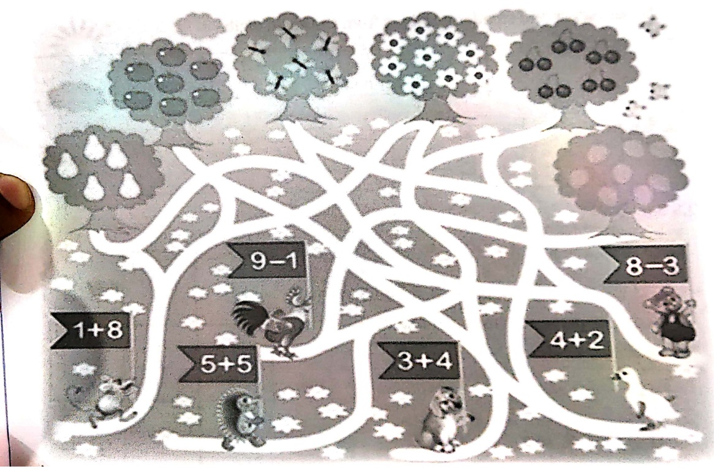

Q.7 Fill in that comes before/ after /between-

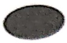

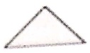

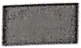

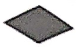

a. Circle the shape that is after the square.

b. Circle the shape that is before triangle.

c. Circle the shape that is in between triangle and diamond.

Q.8 Make bigger and smaller numbers from the given digits-

[Table 11](tables/table_011.html)

Q.9 Solve

1) Write the numbers 0, 3, 4 and 5 in the correct place so that each line of the cross adds up to 8.

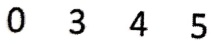

Total must be 8

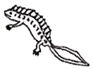

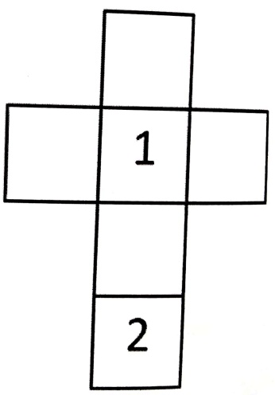

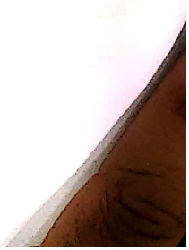

 $$ \begin{array}{ccc} a \cdot 10 \text{Solve} & & \\+&=&\text{=} \\& &\\-&\quad=&\text{8} \\& &\\+&\quad=&\text{10} \\& &\\-&\quad=&\text{2} \end{array} $$ 

Q.11 Dodging
 

[Table 12](tables/table_012.html)

Q.12 Circle the group of ten and write the number of tens and ones-

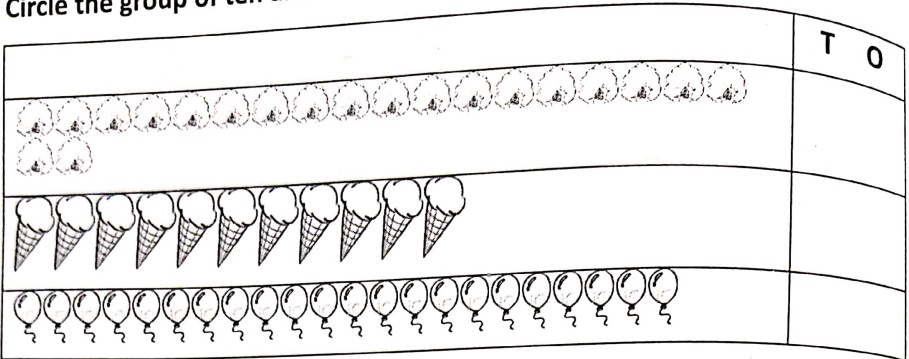

### Q.13 Colour Me

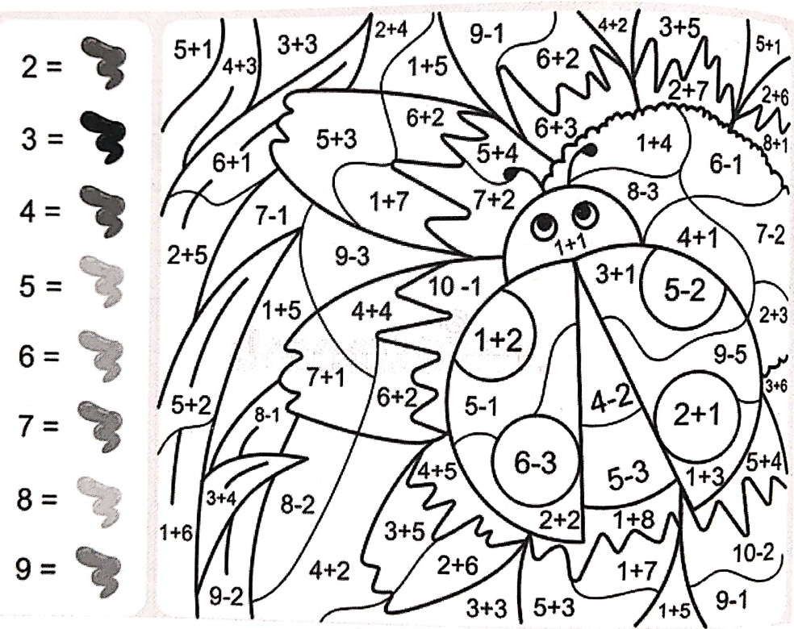

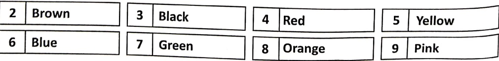

0.14 Solve the riddle -

tens digit is 6 and ones digit is 4. Which number am I? ___

My ones digit is 9 and tens digit is 1. Guess the number? _____

### Q.15 Do as directed-

a) Colour the first, fourth and tenth ball.

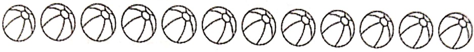

b) Circle the ninth flower pot.

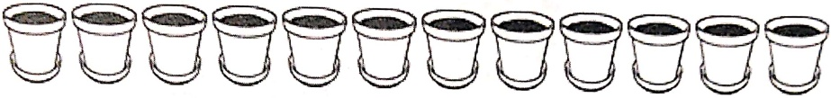

Q.16 Write the position of the ♡ in the given pictures.

a)

- ___

b) ❤️ ___

c) ___ ❤️ ___

### Q.17 Word Problem-

[Table 13](tables/table_013.html)

Q.18 Find the numbers that give a sum of 10 -

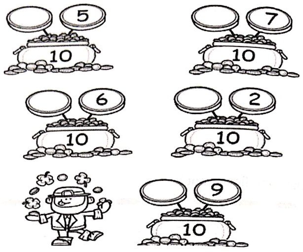

### Q.19. SUKODU-

Fill the card with numbers from 1 to 6. Each number should appear only once in every coloumn, row and square-

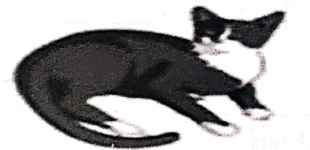

[Table 14](tables/table_014.html)

0.20 Complete the addition word problem-

A) I have _____

get ___

How ___

Complete subtraction word problem

B) Riya has _____

She shared ___

How many ___

[Table 15](tables/table_015.html)

practice Worksheet 1

Date: ___

1. Tables.

[Table 16](tables/table_016.html)

2. Write the number that is -

a. 2 tens and 9 ones -

b. 1 ten

c. 4 tens and 8 ones -

d. 6 tens

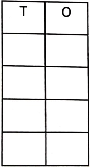

[Table 17](tables/table_017.html)

Practice Worksheet 2

Date: ___

3. Write the place value of the underlined number.

[Table 18](tables/table_018.html)

4. Expanded form

[Table 19](tables/table_019.html)

[Table 20](tables/table_020.html)

Practice Worksheet 3

Date: ___

1.  $ \underline{\text{Solve the sums}} $:

[Table 21](tables/table_021.html)

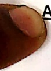

##### Add the following:

 $$ \begin{array}{r}  \text{TO}  \begin{array}{l} 89 \\ + \quad 10 \end{array} $$ 

TO

73

+12

 $$ \begin{array}{c}\text{TO}\\22\\+62\\\hline\end{array} $$ 

TO

54

+30

___

3.  $ \underline{\text{Make a group of ten and then add:}} $

a.

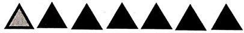

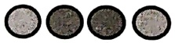

7+4= ___

b.

□□□□□□

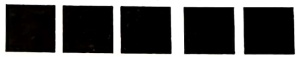

★★★★★★★★★★★★

5+8=___

[Table 22](tables/table_022.html)

#### Practice Worksheet 4

Date ___

1) Draw balls inside the box to make the addition statement true.

A.

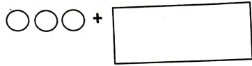

is same as

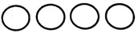

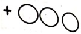

B.

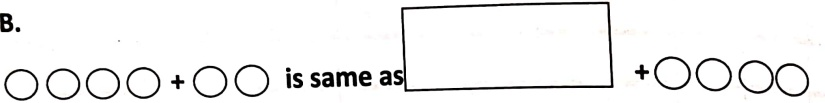

C.

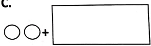

is same as  $ \bigcirc + \bigcirc \bigcirc $

2) Add the following

[Table 23](tables/table_023.html)

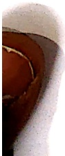

<table border=1 style='margin: auto; word-wrap: break-word;'><tr><td style='text-align: center; word-wrap: break-word;'>Grade: 1</td><td style='text-align: center; word-wrap: break-word;'>