Subject: Maths</td><td style='text-align: center; word-wrap: break-word;'>Topic: Number Sense-1</td></tr></table>

Practice Sheet: 1

Introduction to Digit, Numbers, & Numerals

Instructions:

Observe Column 1

Identify which are Digits, Numbers, and Numeral.

Tick the boxes for each accordingly.

One is done for you!

[Table 1](tables/table_001.html)

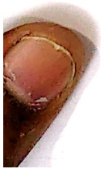

[Table 2](tables/table_002.html)

[Table 3](tables/table_003.html)

[Table 4](tables/table_004.html)

Practice Sheet : 2

Date: ___

[Table 5](tables/table_005.html)

[Table 6](tables/table_006.html)

#### Practice Sheet : 3

Date:20.3.26

##### Q1. Fill in blanks in the missing numbers.

a. 65

b. 71

c. 22

67

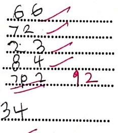

73

d. 83

e. 91

24

85

f. 3

3

93

35

2. Fill in the missing number

[Table 7](tables/table_007.html)

[Table 8](tables/table_008.html)

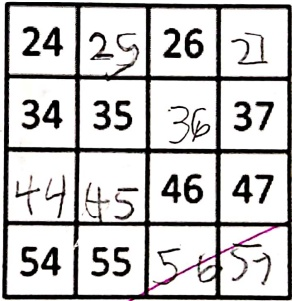

##### Q3. What comes before/after and in between :

a.

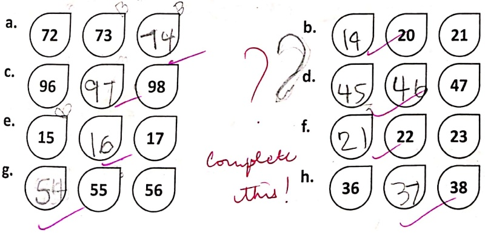

[Table 9](tables/table_009.html)

Practice Sheet: 4

Date:  $ \underline{\text{7.4.2.6}} $

Count by 2s

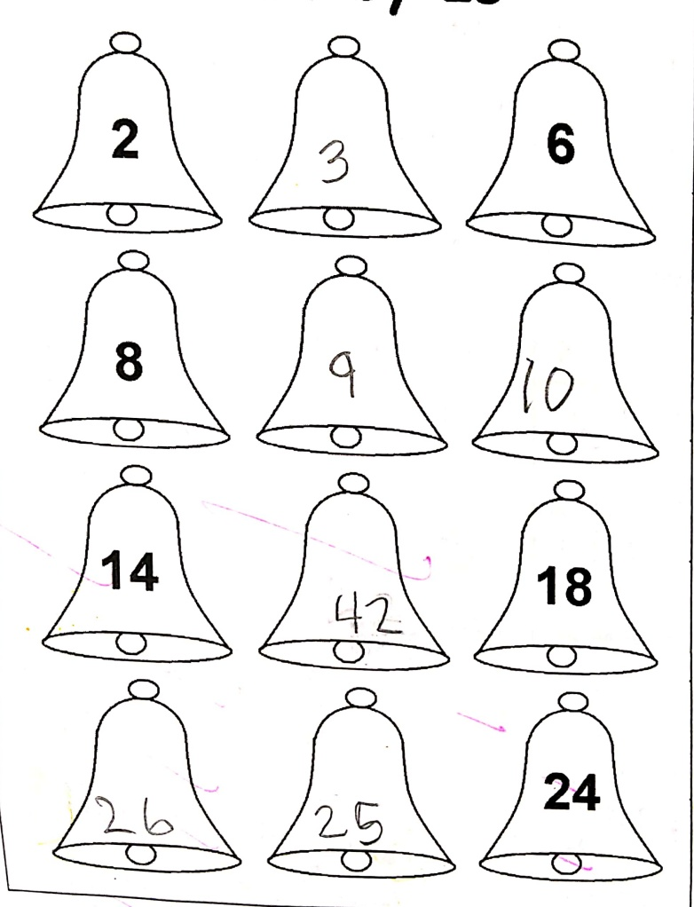

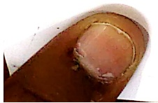

[Table 10](tables/table_010.html)

Practice Sheet : 5

Date: 7.42i

SKIP COUNTING BY 5

The busy bee buzzes on the line. Help her fly by skip counting in 5s

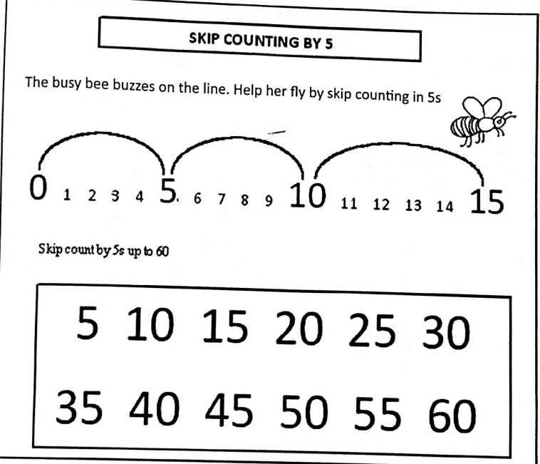

Skip Count by 5's and colour every FIFTH number YELLOW. One example has been done for you.

[Table 11](tables/table_011.html)

[Table 12](tables/table_012.html)

Practice Sheet : 6

Date:6,4,26

Direction- Help the Hippos in picking up the apples and arranging them in the correct pattern using skip count by 10.

## Apple Picking

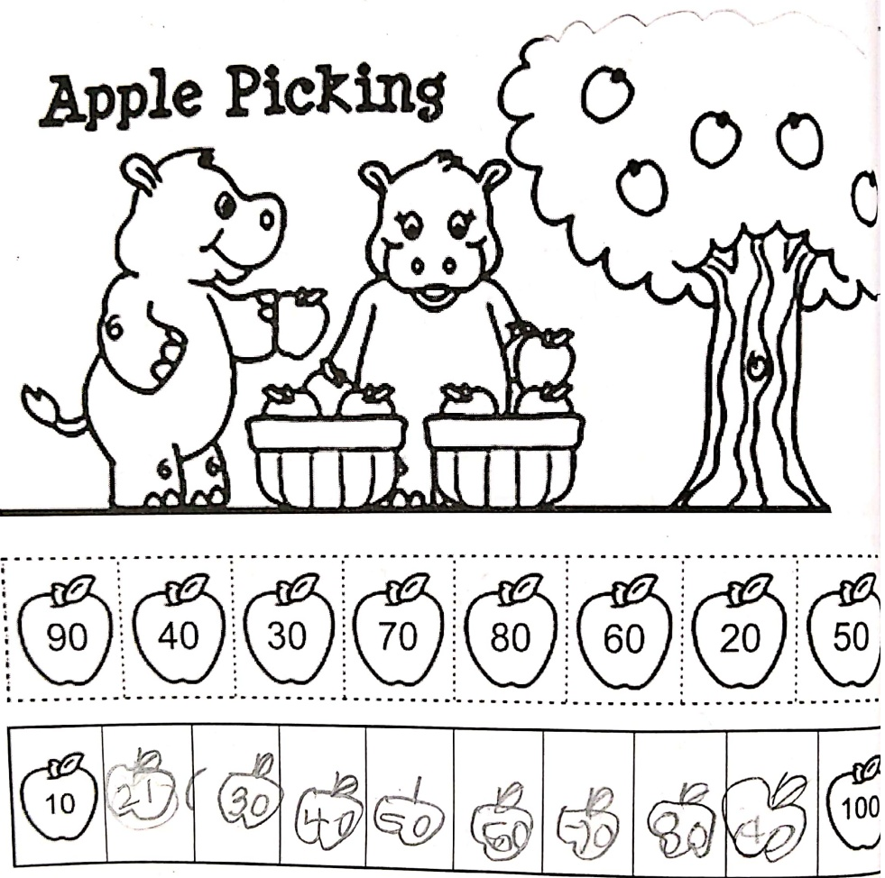

[Table 13](tables/table_013.html)

Practice Sheet : 7

Date: 014.12

Direction- Complete by skip count.

[Table 14](tables/table_014.html)

[Table 15](tables/table_015.html)

##### Practice Sheet : 8

### Q 1.  $ \underline{\text{Write the number names for-}} $

[Table 16](tables/table_016.html)

### Q 2.  $ \underline{\text{Fill in skip count of 2's -}} $

[Table 17](tables/table_017.html)

### Q 3.  $ \underline{\text{Fill in skip count of 5's}} $

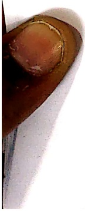

[Table 18](tables/table_018.html)

[Table 19](tables/table_019.html)

Practice Sheet : 9

Date: 16.14.26

Match-up Activity

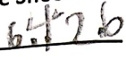

Match the numbers to their number names.

[Table 20](tables/table_020.html)

[Table 21](tables/table_021.html)

Practice Sheet : 10

Date:16.4.20

Write the numerals for the following number names.

[Table 22](tables/table_022.html)

Write the number names for the following numerals.

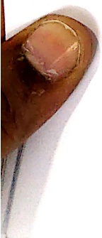

[Table 23](tables/table_023.html)

[Table 24](tables/table_024.html)

Practice Sheet : 11

Date: ___

1.  $ \underline{\text{Write the numerals for}} $

[Table 25](tables/table_025.html)

2.  $ \underline{\text{Match the number names to its numerals-}} $

[Table 26](tables/table_026.html)

[Table 27](tables/table_027.html)

3.  $ \underline{\text{Fill in the missing numbers-}} $

[Table 28](tables/table_028.html)

[Table 29](tables/table_029.html)

Practice Sheet : 12

Date:  $ \underline{\text{18.4.20}} $

Direction: Fill in the blanks.

Write the number that comes just after the given number.

[Table 30](tables/table_030.html)

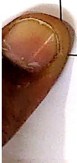

[Table 31](tables/table_031.html)

Practice Sheet : 13

Date: 18.4.26

1. Circle all the numbers that come after the given number:

Example: 37

[Table 32](tables/table_032.html)

66

[Table 33](tables/table_033.html)

52

[Table 34](tables/table_034.html)

8

[Table 35](tables/table_035.html)

17

[Table 36](tables/table_036.html)

34

[Table 37](tables/table_037.html)

[Table 38](tables/table_038.html)

Practice Sheet : 14

Date:  $ \underline{\text{214.26}} $

Direction: Fill in the blanks—

Write the number that comes just before the given number.

[Table 39](tables/table_039.html)

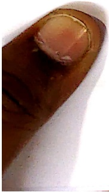

[Table 40](tables/table_040.html)

Practice Sheet : 15

Date: ___

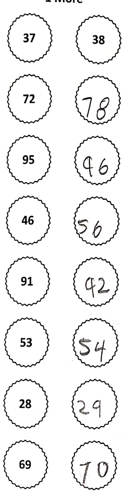

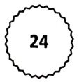

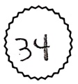

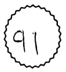

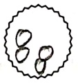

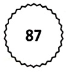

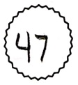

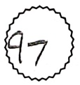

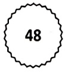

[Table 41](tables/table_041.html)

Practice Sheet : 16

Date:___

Fill in the blanks with the correct number names. You can take help from the help bo

##### HELP-BOX

[Table 42](tables/table_042.html)

1) There are..... children in my class.

2) The rainbow has ..... colours.

3) An octopus has ..... arms.

4) makes a century.

5) I have ..... fingers.

6) The word 'Mathematics' has ..... letters.

7) ..... makes a 'score.'

8) There are ___ eggs in a dozen.

9) A normal adult person has ..... teeth.

10) makes a half-century

[Table 43](tables/table_043.html)

Practice Sheet : 17

Date: ___

Write the number that is 2 more and 2 less than in given number.

2 More and 2 Less
 

[Table 44](tables/table_044.html)

[Table 45](tables/table_045.html)

Practice Sheet : 18

Date:23420

Food for thought: Numeral can't be the digit or the number, however Digit and numbe numerals.

Even and Odd Numbers

Instructions:

- Make pairs – Circle or underline two socks together to make one pair.

Check the pairs:

If all the socks are in pairs, the number is EVEN.

o If one sock is left alone, the number is ODD.

Count how many socks there are.

● Write the number in the box. One example is  $ \underline{\text{done for you!}} $

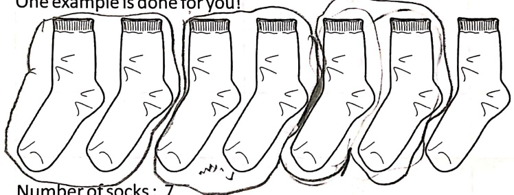

Number of socks: 7

pair=2.30CR3

Thet are 3 pair of 200 R9

is up to it is

<table border=1 style='margin: auto; word-wrap: break-word;'><tr><td style='text-align: center; word-wrap: break-word;'>Grade: 1</td><td style='text-align: center; word-wrap: break-word;'>