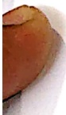

Subject: Maths</td><td style='text-align: center; word-wrap: break-word;'>Topic: Time Test</td></tr></table>

Practice sheet: 1

Fill in the missing numbers: -

[Table 1](tables/table_001.html)

B. Unscramble letters to form number names

[Table 2](tables/table_002.html)

A. Read the number name and circle the correct number:

a. Thirty

b. Fifteen

50 15 55

##### Practice sheet: 2

Date: ___

1. Fill in the blanks.

a) There are _____ teeth in my mouth.

b) 10 comes just before ___.

c) _____ lies in between Tuesday and Thursday.

2. Complete the sequence-

[Table 3](tables/table_003.html)

<table border=1 style='margin: auto; word-wrap: break-word;'><tr><td style='text-align: center; word-wrap: break-word;'>Grade: 1</td><td style='text-align: center; word-wrap: break-word;'>