Subject: Maths</td><td style='text-align: center; word-wrap: break-word;'>Topic: Place Value</td></tr></table>

Practice Sheet : 1

Date:22.4.26

##### Count by tens and ones and write the two digit number

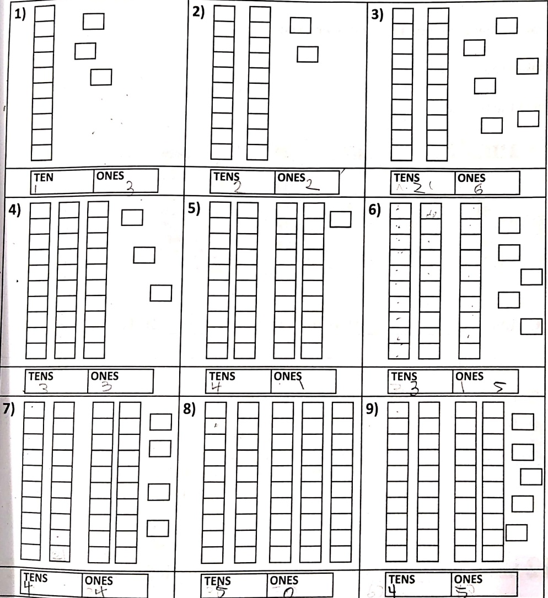

[Table 1](tables/table_001.html)

Practice Sheet: 2

Date:2704.26

##### Direction:

• Draw as many squares as the number given.

• Make groups of ten.

Fill in the blanks.

Example

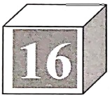

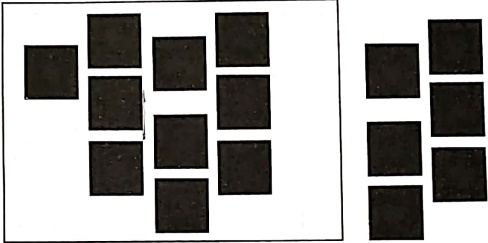

16 has  $ \underline{1} $____ group of ten and  $ \underline{6} $____ leftover ones.

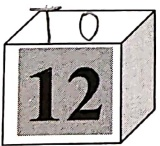

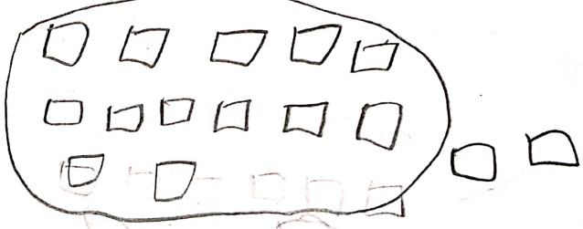

12 has  $ \underline{2} $____ group of ten and ___ leftover ones.

[Table 2](tables/table_002.html)

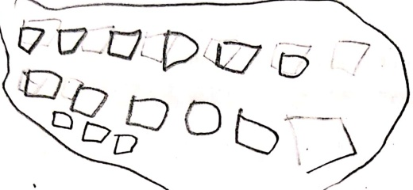

18 has _____ group of ten and ___ leftover ones.

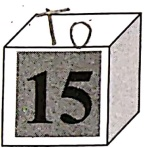

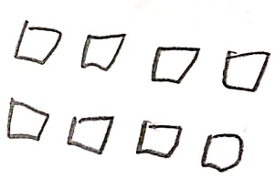

15 has _____ group of ten and ___ leftover ones.

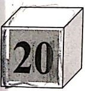

20 has _____ groups of ten and ___ leftover ones.

[Table 3](tables/table_003.html)

Practice Sheet : 3

Date:304426

Direction: Circle the groups of ten and write the number of tens and ones.

[Table 4](tables/table_004.html)

[Table 5](tables/table_005.html)

Practice Sheet : 4

Date:  $ \underline{\text{30.4.26}} $

#### Directions:

Each bundle shows a ten and each loose stick shows a one. Identify the number from the number of sticks. The first one has been done for you.

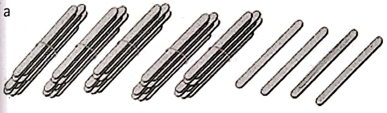

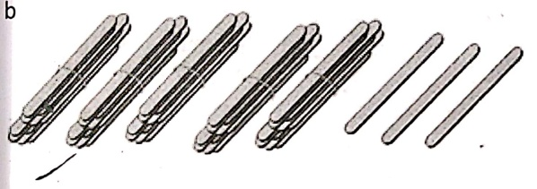

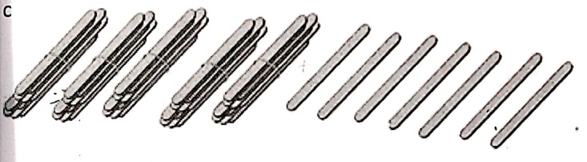

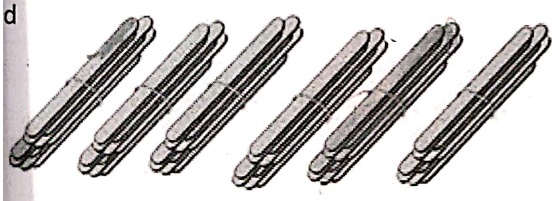

[Table 6](tables/table_006.html)

Practice Sheet : 5

Date:___

Match the standard form in column A with their expanded form in Column B.

[Table 7](tables/table_007.html)

[Table 8](tables/table_008.html)

Practice Worksheet 6

Date ___

Q1. Write in tens and ones:

TO

a. 15-

b. 70-___

c. 11-___

d. 24-___

Q2. Write the number that is:

a. 6 tens and 7 ones-- ___

b. 1 ten and 7 ones-- ___

c. 9 tens and 9 ones-- ___

d. 8 tens-- ___

e.1 one-- ___

f. 3 tens and 6 ones-- ___

Q3. Complete the table:

[Table 9](tables/table_009.html)

[Table 10](tables/table_010.html)

Q4. Write the numbers which have 5 at the tens place:

51, 15, 54, 25,58,65

___, ____, ___

Q5. Circle the numbers which have 5 at the ones place:

51, 15, 54, 25, 58, 65

Q6. Fill in the blanks:-

a. The place value of 5 in 35 is .....

b. The place value of 3 in 35 is .....

c. 10 ones equal one .....

d. 10 tens equal one .....

e. Right digit of a number shows .....

f. Left digit of a number shows .....

g. The place value of 9 in 49 is .....

h. The place value of 4 in 49 is .....

i. The place value of 1 in 17 is .....

j. The place value of 7 in 17 is .....

k. The place value of 8 in 83 is .....

1. The place value of 3 in 83 is .....

<table border=1 style='margin: auto; word-wrap: break-word;'><tr><td style='text-align: center; word-wrap: break-word;'>Grade: 1</td><td style='text-align: center; word-wrap: break-word;'>