Subject: Maths</td><td style='text-align: center; word-wrap: break-word;'>Topic: Math Skill</td></tr></table>

Date ___

Q1 Circle the number which is greater.

[Table 1](tables/table_001.html)

Q2 Count and write the number of dots in the box. Circle the box that has less number of dots.

Cycle then has less

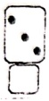

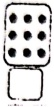

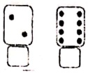

Q3 Circle the smallest number and underline the greatest number in each row:

[Table 2](tables/table_002.html)

Q4 Number the objects from the smallest to biggest. Put 1 below the smallest, 2 below the next smaller number and 3 below the greatest number.

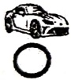

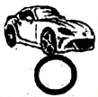

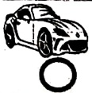

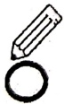

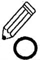

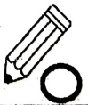

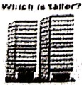

Q5 Put a tick on the taller one.

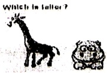

<table border=1 style='margin: auto; word-wrap: break-word;'><tr><td style='text-align: center; word-wrap: break-word;'>Grade: 1</td><td style='text-align: center; word-wrap: break-word;'>