Subject: Maths</td><td style='text-align: center; word-wrap: break-word;'>Topic: Number Sense-2</td></tr></table>

Date _____

Term-2

Topic

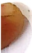

Number Sense - II

Addition of single and double digit numbers without carry over

##### Sub Topics

Comparison

Ascending and Descending order

Number Bonds

● Addition (Single to single, single to double, double to double)

Story problems on Addition

- High Order Cognitive Abilities (Critical Thinking, Problem Solving, Decision Making, Creativity, Empathy, Respect, Collaboration, etc.)

[Table 1](tables/table_001.html)

Practice Sheet : 1

Date:_____

Circle the bigger number:

[Table 2](tables/table_002.html)

[Table 3](tables/table_003.html)

Circle the smaller number:

[Table 4](tables/table_004.html)

[Table 5](tables/table_005.html)

[Table 6](tables/table_006.html)

Practice Sheet: 2

Date: ___

Make bigger and smaller numbers from the given digits:

[Table 7](tables/table_007.html)

[Table 8](tables/table_008.html)

Practice Sheet : 3

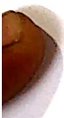

Date: ___

From the pair of numbers, circle the bigger number with green ant the smaller number with red colour in the number chart.

[Table 9](tables/table_009.html)

[Table 10](tables/table_010.html)

Practice Sheet: 4

Date:___

Directions: Use the symbol (> or <) correctly to help Charlie to eat berries that are more in number.

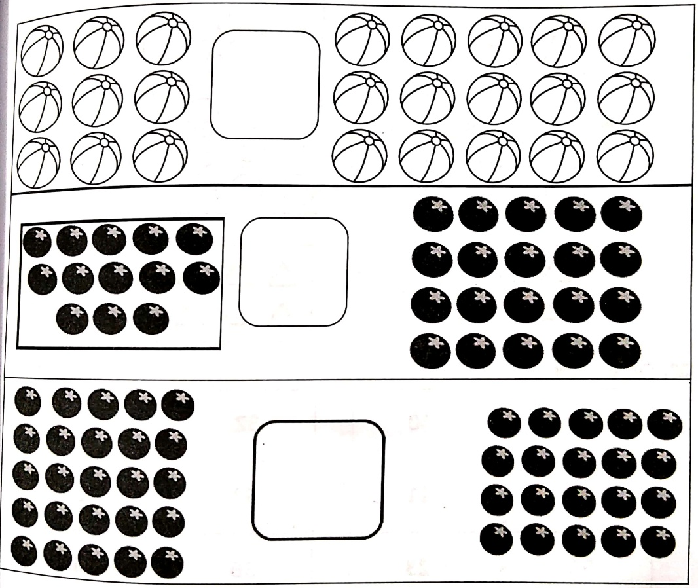

[Table 11](tables/table_011.html)

Practice Sheet : 5

Date: ___

Q1. Observe and draw the same image or cross the extra image to make both the sides equal. Also put the symbol. =

a.

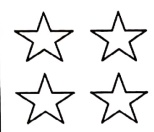

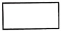

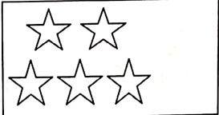

b.

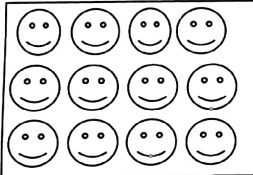

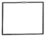

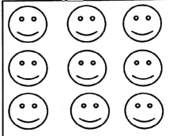

c

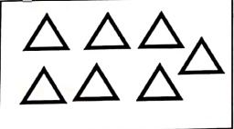

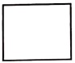

 $$ \triangle\triangle\triangle $$ 

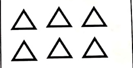

Q2. Circle >, < or =

[Table 12](tables/table_012.html)

[Table 13](tables/table_013.html)

[Table 14](tables/table_014.html)

Practice Sheet: 6

Date: ___

Directions: Read the questions and complete the task.

1. Colour the least number in each row orange.

[Table 15](tables/table_015.html)

2. In each row circle the biggest number and put a tick (✓) on the smallest number.

[Table 16](tables/table_016.html)

[Table 17](tables/table_017.html)

Practice Sheet : 7

Write 1 below the smallest number, 2 below the next smaller number and 3 below the greatest number.

Date: ___

a.
 

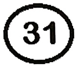

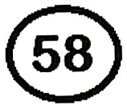

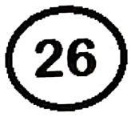

b.
 

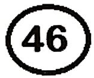

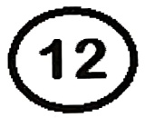

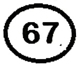

C.
 

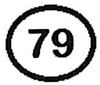

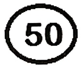

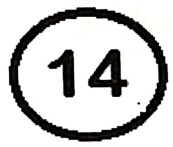

d.
 

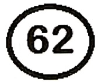

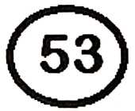

___

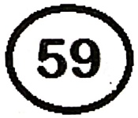

[Table 18](tables/table_018.html)

Practice Sheet: 8

Date: ___

Q1. Look at the numbers given in the boxes.

to in these numbers below in ascending order to help the cat reach the mouse.

81

45

23

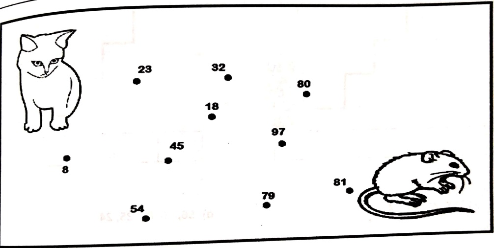

Q2. Arrange the following numbers in ascending order.

76

70

57

78

37

[Table 19](tables/table_019.html)

Practice Sheet : 9

Date: ___

Write the following numbers in ascending order. Write the smallest number on the lowest step, the next smaller number on the step above it and so on.

a) 98, 26, 4, 18, 30

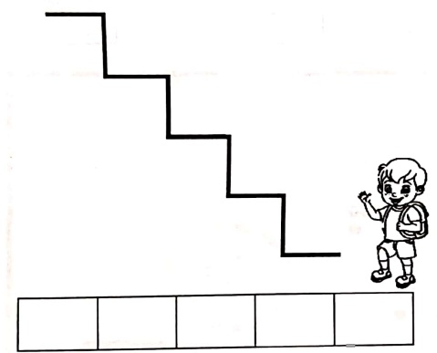

b) 57, 34, 72, 83, 6
 

c) 77, 17, 71, 44, 14

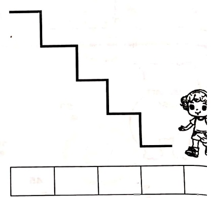

d) 56, 16, 85, 35, 24
 

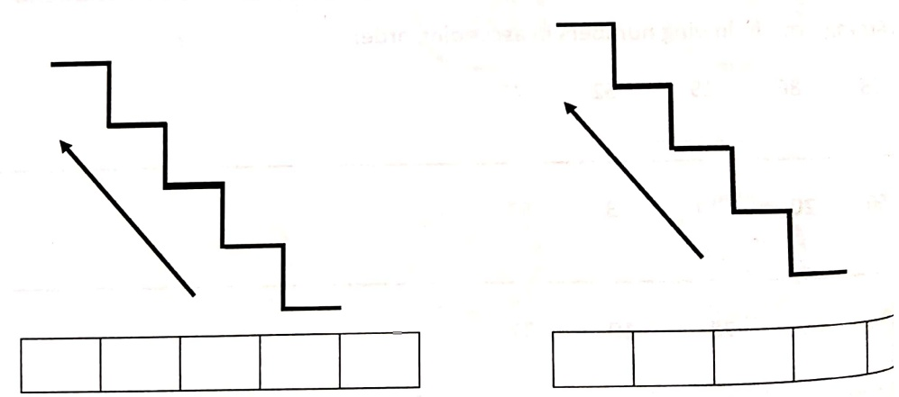

[Table 20](tables/table_020.html)

Practice Sheet : 10

Date: ___

Arrange the given numbers in descending order and colour the same numbers in the grid given below to help the princess to reach the unicorn.

[Table 21](tables/table_021.html)

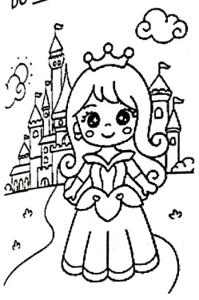

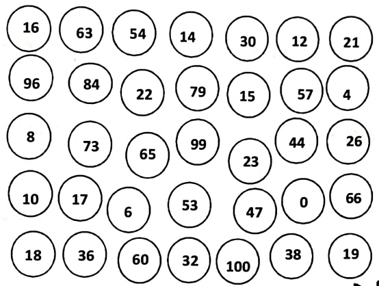

Arrange the following numbers in descending order.

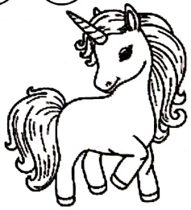

[Table 22](tables/table_022.html)

[Table 23](tables/table_023.html)

Practice Sheet : 11

Date:_____

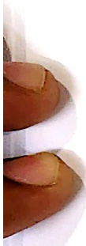

##### Fill in the blanks. (Use the word from the bracket)

1. When the numbers are arranged from the _____ to the _____ they are in their ascending order. (smallest, greatest)

2. In the ascending order the_____number comes first. (smallest, greatest)

3. In the ascending order the_____number comes last. (smallest, greatest)

4. In the ascending order of 34, 70, 90, ___ will come first. (70, 90,

5. In the descending order ___ number comes first. (great smallest)

6. In the descending order of 36, 83, 22_____ will come first. (83, 22,

7. In ascending order_____comes after 25. (30, 26, 24, 52)

8. The second smallest two-digit number in descending order is ___ (10, 11, 19)

[Table 24](tables/table_024.html)

Practice Sheet: 12

Date:___

Value: Save the environment

Q1. Tom planted 52 seeds, Harry planted 13 seeds, Sam planted 94 seeds and Shyam planted 40 seeds on the environment day in their school. Arrange the numbers in ascending and descending order to find out who planted the maximum and least number of seeds.

Ascending order(AO)-_____

planted maximum number of seeds.

Descending order(DO)-___

planted least number of seeds.

Q2. Four friends Sanya, Tanya, Maria and Tina went to a beach to play. They saw that the beach was very dirty so they thought of cleaning it. Sanya picked up 3 bags of cans, Tanya picked up 2 bags of plastic bottles, Maria picked up 7 bags of plastic waste and Tina picked up 5 bags of waste paper. The beach looked clean. Then they put up sign boards "Kindly do not litter on the beach". Arrange the numbers in ascending and descending order to find out who picked up the maximum and least number of litter bags.

Ascending order(AO)-___

_____ picked up maximum number of litter bags.

Descending order(DO)-___ picked up least number of litter bags.

<table border=1 style='margin: auto; word-wrap: break-word;'><tr><td style='text-align: center; word-wrap: break-word;'>Grade: 1</td><td style='text-align: center; word-wrap: break-word;'>