Subject: Maths</td><td style='text-align: center; word-wrap: break-word;'>Topic: Addition</td></tr></table>

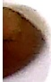

Practice Sheet : 13

Date: ___

##### Draw more to make 10. Write the missing numbers.

[Table 1](tables/table_001.html)

[Table 2](tables/table_002.html)

practice Sheet: 14

Number bonds

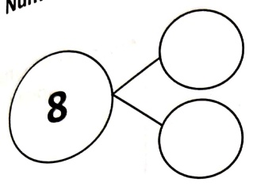

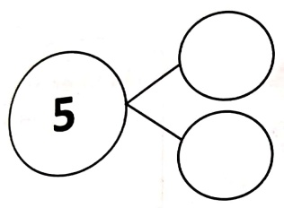

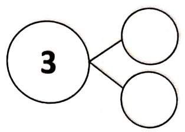

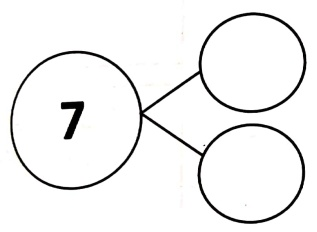

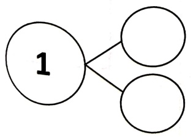

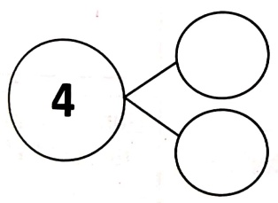

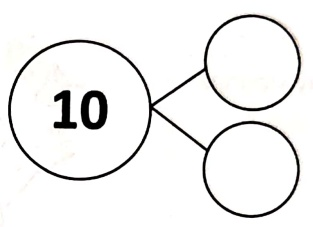

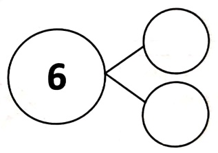

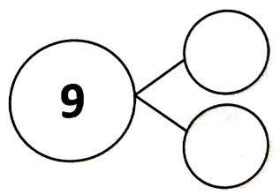

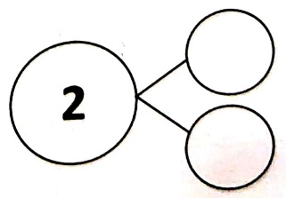

[Table 3](tables/table_003.html)

practice Sheet : 16

Date: ___

Directions: Draw the circles inside the box to make the addition statements true.

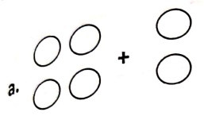

is same as

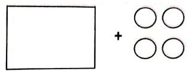

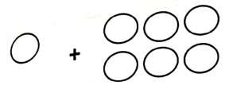

b.
 

is same as

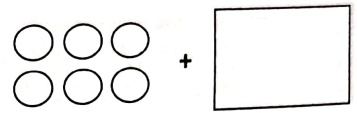

C.
 

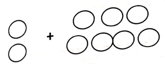

is same as

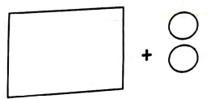

d.
 

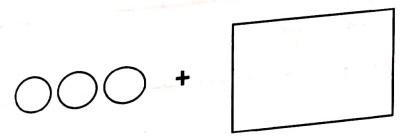

is same as

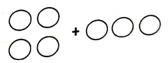

e.
 

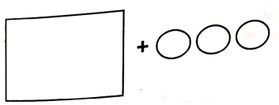

is same as

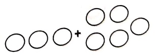

t.
 

is same as

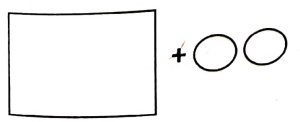

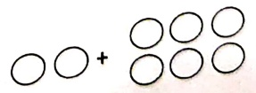

[Table 4](tables/table_004.html)

Practice Sheet : 17

Date: ___

Write the addition sentences to show that by changing the position of the same digits answer remains same.

[Table 5](tables/table_005.html)

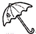

1. ___5___ + ___3___ = ___ is same as ___3___ + ___= ___

2. ___ + ___ = ___ is same as ___ + ___ = ___

+ ___ = ___ is same as ___ + ___ = ___

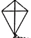

4. ___ + ___ = ___ is same as ___ + ___ = ___

5. ∇ ___ + ___ = ___ is same as ___ + ___ = ___

6. ___ + ___ = ___ is same as ___ + ___ = ___

[Table 6](tables/table_006.html)

practice Sheet : 18

Date:

solve the following:

[Table 7](tables/table_007.html)

[Table 8](tables/table_008.html)

Practice Sheet : 19

Date: ___

Solve the following:

[Table 9](tables/table_009.html)

[Table 10](tables/table_010.html)

practice Sheet: 20

date:___

Directions: Make a group of ten and then add. First one has been done for you.

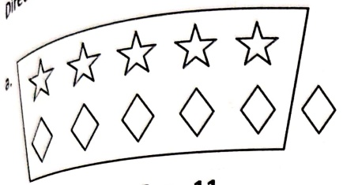

 $$ 5+6=11 $$ 

b.
 

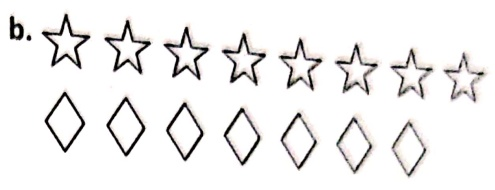

 $$ 8+7=☐ $$ 

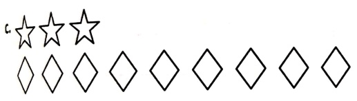

 $$ 3+9=☐ $$ 

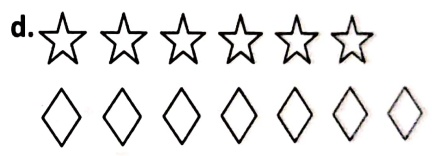

 $$ 6+7= \quad \Box  $$ 

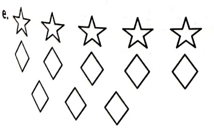

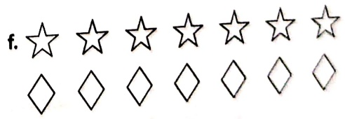

 $$ \begin{array}{l} 5+8=\end{array} $$ 

 $$ 7+7= \Box  $$ 

[Table 11](tables/table_011.html)

Practice Sheet : 21

Date: ___

[Table 12](tables/table_012.html)

[Table 13](tables/table_013.html)

actice Sheet: 22

give the following:

[Table 14](tables/table_014.html)

[Table 15](tables/table_015.html)

Practice Sheet : 23

Date: ___

Solve the following:

[Table 16](tables/table_016.html)

[Table 17](tables/table_017.html)

practice Sheet : 24

Date: ___

Solve the following:

[N]

[Table 18](tables/table_018.html)

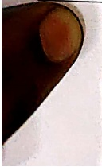

[Table 19](tables/table_019.html)

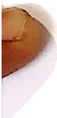

Practice Sheet : 25

Date: ___

Solve the following:

[Table 20](tables/table_020.html)

[Table 21](tables/table_021.html)

Practice Sheet: 26

Date: ___

Solve the following:

[Table 22](tables/table_022.html)

[Table 23](tables/table_023.html)

##### Practice Worksheet 27

##### Complete the following -

1. Abhay planted 9 carrots.

Ell gave her 10 more carrots.

How many carrots are there in all?

___+___=___

2. Andhrew planted 12 pumpkins.

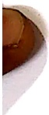

Then he planted 8 more pumpkins.

How many pumpkins are there in all?

3. Sara planted 10 potatoes.

Anna gave her 7 more potatoes.

How many potatoes are there in all?

4. Eva planted 8 onions.

Then he planted 7 more onions.

How many onions are there in all?

[Table 24](tables/table_024.html)

Practice Sheet : 28

Date: ___

Word Problem :

[Table 25](tables/table_025.html)

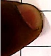

[Table 26](tables/table_026.html)

Practice Sheet : 29

Date: ___

Word Problem :

[Table 27](tables/table_027.html)

[Table 28](tables/table_028.html)

practice Sheet: 30

Date:___

Directions: Solve the given questions.

pooja has drawn pictures of few circles they are represented in tens and ones. Fill in the blanks to know the addition sentences.

A.

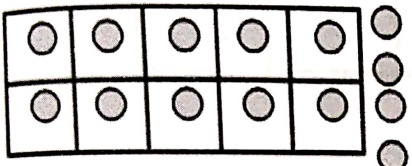

How many groups of 10 are there? _____

How many ones are there? _____

You get _____ as an addition sentence.

How many circles are there in all? _____

B.

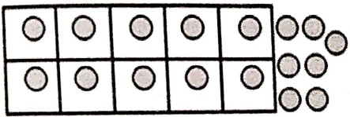

How many groups of 10 are there? _____

How many ones are there? _____

You get _____ as an addition sentence.

How many circles are there in all? _____

C.

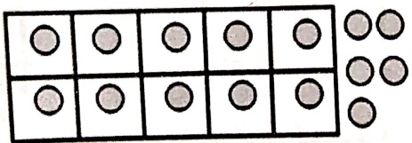

How many groups of 10 are there? _____

How many ones are there? _____

You get _____ as an addition sentence.

How many circles are there in all? _____

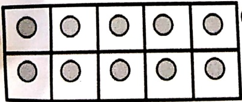

How many groups of 10 are there? _____

How many ones are there? _____

You get _____ as an addition sentence.

How many circles are there in all? _____

[Table 29](tables/table_029.html)

Practice Sheet : 31

Date: ___

Q1. Pooja has 18 toffees in all. Represent in tens and ones to show 18 and answer that given questions

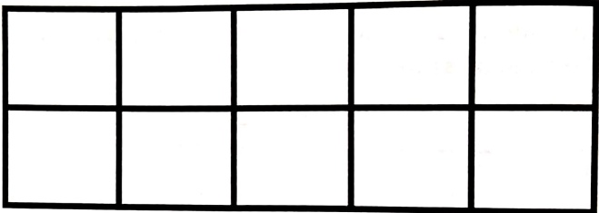

a. Show 18

b. How many tens are there ?_____

c. How many ones are there? _____

d. Write the addition statement for it _____

Q2. Tina has 24 candies in all. Use tens and ones to show 24 and answer the given question.

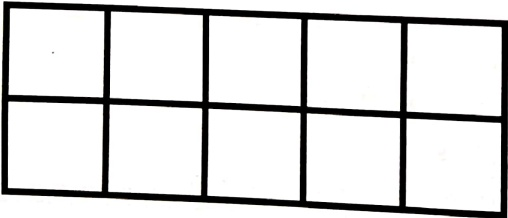

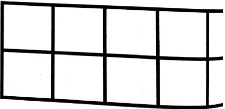

a. Show 24

b. How many tens are there? _____

c. How many ones are there? _____

d. Write the addition statement for it _____

[Table 30](tables/table_030.html)

Practice Sheet : 32

Date: ___

#### Value- Helpfulness, Unity, Gratitude

Q1. It was a bright sunny day when the 3 friends Ria, Sia and Tia went for a morning walk. Ria planned to give hand made masks to every one so that everybody is safe from germs. Sia helped her in making 9 masks and Tia helped her in making 7 masks. Ria thanked everyone for being helpful and working as a team. How many masks did they make altogether?

##### Value- Save the environment

Q2. Tanya was the owner of a nursery. She loved natural beauty of the city. In order to save the environment, she thought of distributing plants among her customers, so that each one of them could plant and enhance the natural beauty of the city. On Monday she distributed 41 plants and on Wednesday she distributed 18 plants. How many total number of plants did she distribute?

##### Value-Empathy

Q3. One day Rina's teachers thought of making a big box holder with some spare stationery for a village school. She told Rina to bring as many ice cream sticks as she could arrange. The next day Rina brought 92 ice cream sticks to the class. Her teacher already had 6 ice cream sticks. How many total ice cream sticks did they have to make the box?

___

<table border=1 style='margin: auto; word-wrap: break-word;'><tr><td style='text-align: center; word-wrap: break-word;'>Grade: 1</td><td style='text-align: center; word-wrap: break-word;'>